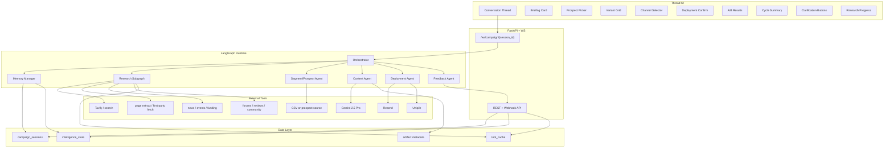

# Signal to Action - Architecture v2
### Improved System Design for Veracity Deep Hack

---

## 1. Purpose

Signal to Action is a closed-loop growth intelligence system that turns live market signal into research, content, outreach, feedback, and refined next-step action inside a single conversation.

This v2 architecture tightens the original design in five places that were still underspecified:

- robust memory and context management
- explicit prospect and audience operating flow
- deeper, configurable research tooling with bounded branching
- durable feedback traceability from provider event back to deployment record
- richer in-thread UI rendering with clickable dynamic actions instead of passive cards

The goal is not only to describe a compelling demo. The goal is to define an implementation that can survive long sessions, partial failures, and multiple campaign cycles without losing state fidelity.

---

## 2. Core Principles

### 2.1 The loop must close

Every cycle must move through:

1. live signal discovery
2. typed intelligence synthesis
3. traceable content generation
4. targeted deployment
5. engagement ingestion
6. confidence update and next-cycle refinement

### 2.2 The conversation is the workspace

Research findings, segment choices, prospect lists, channel decisions, deployment confirmations, and A/B results render inline as interactive UI blocks. The user should not leave the thread to operate the system.

### 2.3 Memory is layered

The system should not rely on a large LLM context window alone. It must distinguish:

- working memory for the current turn
- session memory for the active campaign
- long-term intelligence memory across cycles
- cached tool memory for expensive external reads

### 2.4 Research is bounded, not shallow

The Research Agent may branch into sub-investigations, but only under explicit depth and budget controls.

### 2.5 Every action is traceable

Every generated artifact, deployment, and feedback event must be linkable back to the findings and decisions that produced it.

---

## 3. High-Level Architecture



---

## 4. Runtime Agents

### 4.1 Orchestrator

Responsibilities:

- classify user intent
- decide stage transitions
- request clarification when state is insufficient
- ask Memory Manager for the correct context bundle before invoking a specialist
- emit UI actions, not only text replies

Supported intents:

- `research`
- `segment`
- `generate`
- `deploy`
- `feedback`
- `refined_cycle`
- `clarify`
- `idle`

### 4.2 Research Subgraph

The Research Agent is a bounded multi-tool graph, not a single prompt.

Threads:

- competitor
- audience
- channel
- market
- adjacent
- temporal

Each primary thread can spawn at most `N` bounded sub-investigations when evidence suggests a concrete branch such as:

- a new competitor launch
- a repeated audience pain point worth drilling into
- a regulatory event affecting buying timing
- a channel signal that requires source verification

### 4.3 Segment/Prospect Agent

This is new in v2.

Responsibilities:

- turn research findings into target segments
- retrieve or ingest prospect data
- score prospects against the chosen segment and message angle
- render a prospect selection UI in-thread

Without this layer, personalised outreach is only theoretical.

### 4.4 Content Agent

Responsibilities:

- generate outreach, social content, briefs, and visual directions
- force every output to reference source finding IDs
- generate A/B variants with explicit hypotheses
- request missing deployment prerequisites if prospects or channels are absent

### 4.5 Deployment Agent

Responsibilities:

- personalize content using selected prospects
- split recipients into A/B cohorts
- send across allowed channels
- persist a deployment record per send attempt
- attach provider IDs needed for later feedback correlation

### 4.6 Feedback Agent

Responsibilities:

- normalize incoming webhook events and manual feedback
- map events to deployment records
- aggregate by variant, segment, and channel
- update finding confidence
- create the next intelligence entry and cycle summary

### 4.7 Memory Manager

This is new in v2 and should be treated as a first-class internal service.

Responsibilities:

- persist and retrieve `CampaignState`
- construct context bundles for each agent
- summarize stale conversation safely
- maintain token budgets
- evict non-critical transient payloads from working prompts
- load long-term intelligence selectively

---

## 5. Memory Model

The system needs four distinct memory layers.

### 5.1 Working Memory

Short-lived context used for the current model call.

Contents:

- latest user message
- current UI action
- active stage snapshot
- last few conversational turns
- current task-specific summaries

Retention:

- only for the active invocation

### 5.2 Session Memory

State for the active campaign session.

Stored in `campaign_sessions`.

Contents:

- conversation transcript
- stage outputs
- selected segment
- selected prospects
- selected channels
- deployment plan
- active cycle number
- summaries produced by Memory Manager

Retention:

- entire session lifetime

### 5.3 Intelligence Memory

Durable cross-cycle learning stored in `intelligence_store`.

Contents:

- research findings
- content variants
- deployment records
- engagement results
- intelligence entries
- segment performance history
- channel performance history

Retention:

- long term

### 5.4 Tool Memory

Caches and normalized external results.

Contents:

- search result cache
- extracted page text
- normalized competitor snapshots
- event dedupe ledger

Retention:

- based on TTL per source

---

## 6. Context Management

The original design leaned too heavily on the model context window. v2 adds explicit context policy.

### 6.1 Context Bundle Construction

Before every specialist call, Memory Manager assembles a context bundle with:

- `task_header`
- `current_stage_state`
- `latest_user_intent`
- `recent_messages`
- `relevant_cycle_summary`
- `top_long_term_findings`
- `selected_entities`
- `tool_results_needed_for_this_call`

Agents do not receive the full raw session by default.

### 6.2 Token Budget Policy

Each agent gets a target prompt budget:

| Agent | Budget Strategy |
|---|---|
| Orchestrator | last 8-12 turns + stage summary + intent history |
| Research thread | task brief + prior intelligence summary + only thread-relevant context |
| Research synthesis | merged finding summaries, not raw page extracts unless confidence conflict exists |
| Segment/Prospect | segment criteria + prospect summaries + top findings |
| Content | briefing summary + source findings + selected segment + winning angle memory |
| Deployment | selected variant + selected prospects + channel rules |
| Feedback | deployment records + normalized metrics + source finding refs |

### 6.3 Summarization Policy

When the conversation exceeds threshold:

1. preserve raw transcript in storage
2. generate a rolling `conversation_summary`
3. generate a `decision_log`
4. preserve verbatim only:
   - latest 8-12 turns
   - unresolved clarification messages
   - explicit user approvals
   - final selected variants, channels, and prospects

### 6.4 Retrieval Policy

When an agent needs historical information, it should not pull all prior data. It should request:

- top `k` high-confidence findings for this segment
- last intelligence entry for this product and segment
- previous winning and losing angles
- recent channel performance summaries
- exact prior evidence only when a claim is being revalidated

### 6.5 Context Safety Rules

- never pass raw scraped pages wholesale into synthesis if structured extraction exists
- never include whole prospect lists in the prompt; pass compact prospect cards
- never include full deployment logs unless debugging correlation failure
- prefer IDs plus summaries over raw objects

---

## 7. Campaign State v2

```python
class CampaignState(TypedDict):
    session_id: str
    product_name: str
    product_description: str
    target_market: str

    messages: Annotated[list, add_messages]
    conversation_summary: Optional[str]
    decision_log: list[dict]
    intent_history: list[str]

    current_intent: Optional[str]
    previous_intent: Optional[str]
    next_node: Optional[str]
    clarification_question: Optional[str]
    clarification_options: list[str]
    session_complete: bool

    cycle_number: int
    prior_cycle_summary: Optional[str]
    active_stage_summary: Optional[str]

    research_query: Optional[str]
    active_thread_types: list[str]
    research_findings: Annotated[list, operator.add]
    briefing_summary: Optional[str]
    research_gaps: list[str]
    failed_threads: list[str]

    selected_segment_id: Optional[str]
    segment_candidates: list[dict]
    selected_prospect_ids: list[str]
    prospect_pool_ref: Optional[str]
    prospect_cards: list[dict]

    content_request: Optional[str]
    content_variants: list[dict]
    selected_variant_ids: list[str]
    visual_artifacts: list[dict]

    selected_channels: list[str]
    ab_split_plan: Optional[dict]
    deployment_confirmed: bool
    deployment_records: list[dict]

    normalized_feedback_events: list[dict]
    engagement_results: list[dict]
    winning_variant_id: Optional[str]

    memory_refs: dict
    error_messages: list[str]
```

Key changes:

- adds `conversation_summary` and `decision_log`
- adds segment and prospect state
- supports multiple selected variants if the flow wants multi-channel deployment
- separates raw normalized events from aggregated engagement results

---

## 8. Research Architecture v2

### 8.1 Source Diversity

The Research Agent should support multiple tool classes, configured by policy rather than buried only in prompt text.

Tool groups:

- search discovery: `search_web`
- deep extraction: `extract_page`
- news and events: `search_news`
- community language: `search_community`
- structured company data: `lookup_company`
- trend data: `lookup_trends`
- cache and snapshot reads: `get_cached_source`

### 8.2 Thread-to-Tool Mapping

| Thread | Primary tools | Typical outputs |
|---|---|---|
| competitor | search_web, extract_page, lookup_company, search_news | messaging gaps, launches, pricing changes |
| audience | search_community, search_web, extract_page | exact pain language, intent signals, objections |
| channel | search_web, search_news, search_community | format examples, performance cues, channel decay |
| market | search_news, lookup_company, search_web | funding, regulatory, macro shifts |
| adjacent | search_web, search_news | substitute threats, adjacent entrants |
| temporal | search_news, lookup_trends | seasonality, buying windows, event-driven timing |

### 8.3 Bounded Branching

Each thread may branch only when:

- a new lead has confidence above threshold
- the branch type is in the allowed policy
- the thread still has remaining depth budget

Recommended defaults:

- max primary threads: `6`
- max branch depth: `2`
- max sub-investigations per thread: `2`
- max total extracted pages per cycle: `30`

### 8.4 Research Policy Object

```python
class ResearchPolicy(TypedDict):
    enabled_threads: list[str]
    max_search_results_per_query: int
    max_pages_to_extract: int
    max_branch_depth: int
    max_subinvestigations_per_thread: int
    recency_days: int
    allowed_tool_groups: list[str]
    evidence_threshold: float
```

This object should live in state and be configurable at runtime. Prompting may influence strategy, but code owns the hard constraints.

---

## 9. Prospect and Segment Flow

This is a missing loop stage in the original draft.

### 9.1 Segment Generation

After research synthesis, the system should derive candidate target segments such as:

- VP Sales at Series B SaaS
- RevOps leaders in outbound-heavy teams
- founders replacing SDR headcount with AI

### 9.2 Prospect Ingestion

Supported inputs:

- uploaded CSV
- CRM connector
- demo seed list
- manual entry

### 9.3 Prospect Scoring

Each prospect gets:

- fit score
- urgency score
- message angle recommendation
- channel recommendation
- personalization fields

### 9.4 Prospect Picker UI

The conversation should render a clickable prospect selection interface, not ask the user to paste IDs.

Example actions:

- `Select top 10`
- `Filter by title`
- `Use ROI angle`
- `Use competitor-gap angle`
- `Deploy to selected`

---

## 10. Content and A/B Architecture

Every variant must include:

- source finding IDs
- target segment ID
- intended channel
- hypothesis
- success metric

Example hypothesis:

`"Leading with competitor-message gap will increase reply rate for VP Sales at Series B SaaS companies."`

The system should generate variants as experiments, not merely stylistic alternatives.

---

## 11. Deployment and Traceability

### 11.1 Deployment Requirements

Each deployment record must capture:

- variant ID
- segment ID
- prospect ID
- channel
- provider
- provider message ID
- A/B cohort
- rendered content hash

### 11.2 Event Correlation

Webhook ingestion must support mapping from provider event to deployment record.

That requires:

- `provider_message_id`
- optional `provider_event_id`
- dedupe key
- correlation fallback rules

### 11.3 Normalization Layer

Incoming events from different providers should be normalized into:

```python
class NormalizedFeedbackEvent(BaseModel):
    provider: str
    provider_event_id: Optional[str]
    provider_message_id: Optional[str]
    deployment_record_id: Optional[str]
    session_id: str
    variant_id: Optional[str]
    prospect_id: Optional[str]
    channel: str
    event_type: Literal["sent", "open", "click", "reply", "bounce", "manual_report"]
    event_value: Optional[float]
    qualitative_signal: Optional[str]
    received_at: datetime
    dedupe_key: str
```

This normalized event stream should be stored before aggregation.

---

## 12. Feedback and Learning

Feedback should update memory at three levels:

- deployment-level performance
- variant/segment/channel performance
- long-term finding confidence

Confidence updates should not be based only on a winner/loser binary. They should consider:

- sample size
- channel effect
- segment effect
- metric quality
- recency

Recommended v2 behavior:

- do not over-update confidence on tiny samples
- track confidence update rationale
- write a compact `learning_delta` record each cycle

---

## 13. Ephemeral UI Rendering Model

The UI layer should render structured blocks triggered by server frames.

### 13.1 Outbound UI Frame

```json
{
  "type": "ui_component",
  "component": "ProspectPicker",
  "instance_id": "ui_123",
  "props": {},
  "actions": [
    {
      "id": "select_top_10",
      "label": "Select Top 10",
      "action_type": "ui_action",
      "payload": { "action": "select_top_prospects", "count": 10 }
    }
  ]
}
```

### 13.2 Inbound UI Action

```json
{
  "type": "ui_action",
  "instance_id": "ui_123",
  "action_id": "select_top_10",
  "payload": { "count": 10 }
}
```

### 13.3 Dynamic Button Rules

Buttons must be:

- state-aware
- idempotent where possible
- permission-safe
- attached to explicit backend actions

Examples:

- `Generate Content`
- `Drill Into Finding`
- `Pick Segment`
- `Select Prospects`
- `Confirm Channels`
- `Confirm & Deploy`
- `Run Next Cycle`
- `Retry Failed Thread`

### 13.4 Required UI Components in v2

- Intelligence Briefing Card
- Research Progress
- Clarification Prompt
- Segment Selector
- Prospect Picker
- Variant Comparison Grid
- Channel Selector
- Deployment Confirmation Card
- Delivery Status Card
- A/B Results Widget
- Cycle Summary Card
- Error Recovery Card

---

## 14. Memory-Aware UI Behavior

UI actions should also reduce prompt load.

Examples:

- selecting a variant should store only the variant ID and a short label in the next prompt, not the whole card payload
- clicking `Run Next Cycle` should pass the curated `next_cycle_brief`, not the full results widget data
- prospect filters should update state references, not append large tables into conversation messages

The thread should remain human-readable while the structured state carries the heavy payloads.

---

## 15. API Additions

New APIs needed in v2:

- `POST /campaign/{session_id}/prospects/import`
- `GET /campaign/{session_id}/prospects`
- `POST /campaign/{session_id}/segments/select`
- `POST /campaign/{session_id}/ui-action`
- `POST /webhook/resend`
- `POST /webhook/unipile`
- `GET /campaign/{session_id}/feedback-events`

The generic `/webhook/engagement` endpoint can remain as a normalized fallback, but provider-specific endpoints should exist for raw event correlation.

---

## 16. Failure and Recovery Design

### 16.1 Research Failures

- failed thread should produce a retry button inline
- fan-in should continue with partial findings
- branch failures should not kill the parent thread

### 16.2 Memory Failures

- if summary generation fails, retain raw transcript and mark context as degraded
- if Mongo read fails, continue with local session cache when possible

### 16.3 Deployment Failures

- if provider send fails, show failed recipients inline
- allow resend of only failed subset

### 16.4 Feedback Correlation Failures

- store unmatched webhook events in a quarantine collection
- surface an operator card with `Retry Correlation`

---

## 17. Implementation Priorities

### Must-have

- Memory Manager
- Prospect and segment flow
- normalized feedback event model
- provider message correlation
- dynamic button-driven UI action contract
- bounded research branching

### Should-have

- thread-level retry actions
- performance memory by channel and segment
- event quarantine tooling

### Nice-to-have

- adaptive research policy tuning from cycle results
- prospect-source connectors beyond CSV/demo seed

---

## 18. Why v2 Is Stronger

This architecture is stronger than the original markdown because it no longer depends on implied behavior for the most fragile parts of the loop.

It now explicitly defines:

- how memory is stored, summarized, retrieved, and budgeted
- how context is trimmed without losing durable decisions
- how prospects enter the system and become deployable recipients
- how research can go deeper without becoming unbounded
- how feedback events are mapped back to sends
- how UI components expose clickable backend actions instead of static rendering

That makes the design more credible both as a hackathon system and as a production-grade architecture path.
