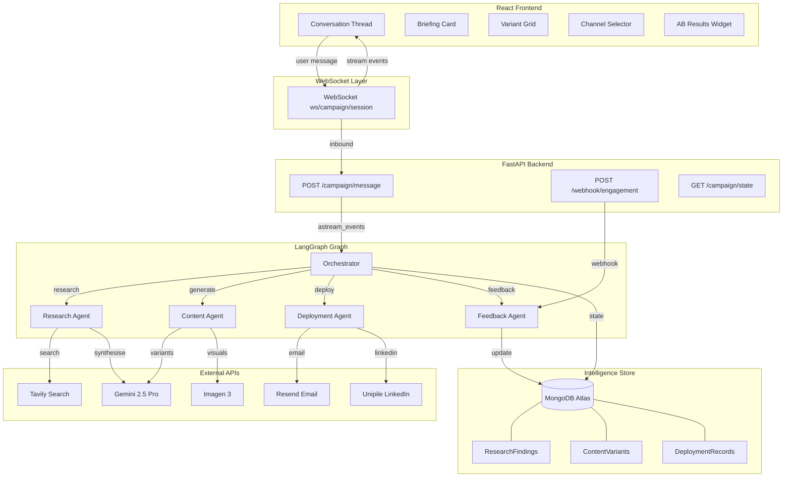
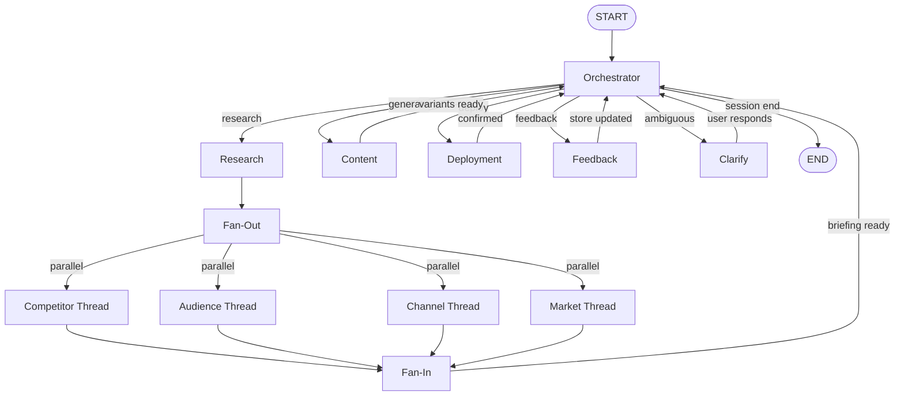
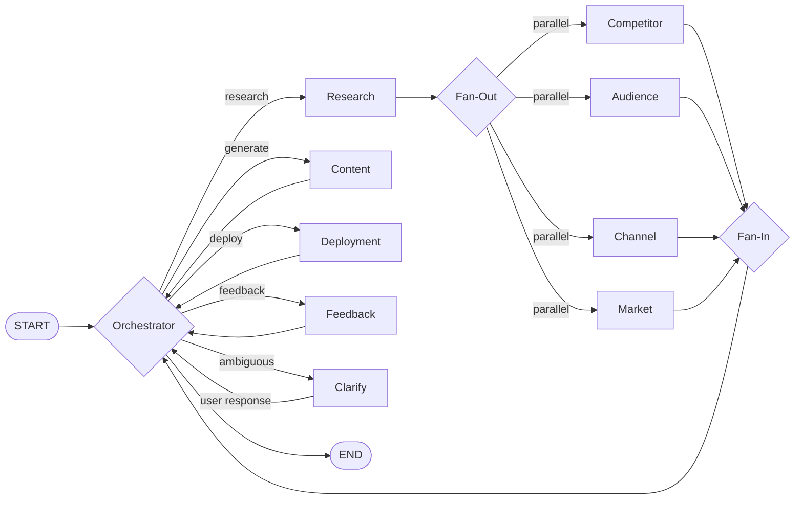
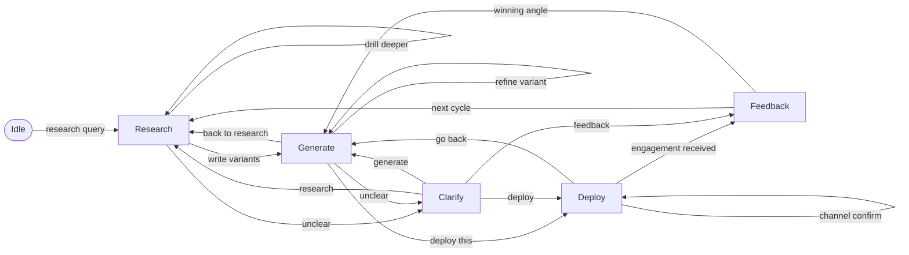

# Signal to Action — Full System Architecture
### Veracity Deep Hack · Multi-Agent Growth Intelligence Platform

---

## Table of Contents

1. [Executive Summary](#1-executive-summary)
2. [High-Level Architecture](#2-high-level-architecture)
3. [LangGraph Graph Design](#3-langgraph-graph-design)
4. [Agent Design Specifications](#4-agent-design-specifications)
5. [Data Models & Schemas](#5-data-models--schemas)
6. [Intelligence Store Design](#6-intelligence-store-design)
7. [FastAPI Backend Design](#7-fastapi-backend-design)
8. [React Frontend Design](#8-react-frontend-design)
9. [External API & Integration Requirements](#9-external-api--integration-requirements)
10. [Parallelism Design](#10-parallelism-design)
11. [Intent Detection & Mode Switching](#11-intent-detection--mode-switching)
12. [Error Handling & Graceful Degradation](#12-error-handling--graceful-degradation)
13. [Testing Strategy](#13-testing-strategy)
14. [Demo Execution Plan](#14-demo-execution-plan)
15. [Open Questions & Technical Risks](#15-open-questions--technical-risks)

---

## 1. Executive Summary

### System Purpose

Signal to Action is a closed-loop, multi-agent growth intelligence platform that takes a product through a complete campaign cycle — live market research, content generation, multi-channel deployment, engagement feedback ingestion, and intelligence refinement — inside a single conversational interface, without tool switching or context loss. The system's defining property is not that it responds to queries but that it **acts**: researching autonomously in parallel threads, generating typed and traceable content variants, deploying them via Resend and Unipile, and feeding real-world engagement back into the Intelligence Store so each cycle starts sharper than the last.

### Core Architectural Decisions

| Layer | Choice | Rationale |
|---|---|---|
| LLM | Gemini 2.5 Pro | Best-in-class reasoning, 1M token context window holds full campaign state, native tool use |
| Agent orchestration | LangGraph | Explicit state graph, conditional routing, native fan-out/fan-in, built-in checkpointing |
| Backend | FastAPI (async) | Native async, WebSocket support, clean LangGraph `astream_events` integration |
| Frontend | React + Zustand | Component model maps to ephemeral UI pattern; Zustand handles streaming state with minimal boilerplate |
| Intelligence Store | MongoDB Atlas (free tier) | Document store handles semi-structured research findings natively; no schema migration overhead |
| Streaming | WebSocket | Bidirectional, single persistent connection, best for multi-agent progress streaming |

### What Makes This a System, Not a Chatbot

Three properties distinguish Signal to Action from a conversational LLM wrapper:

**1. The loop closes.** Engagement data from deployed campaigns enters via manual chat input or webhook POST — both hitting the same feedback ingestion endpoint — and updates confidence scores in the Intelligence Store. The next research cycle bootstraps from accumulated real-world signal, not from scratch.

**2. State is typed and persistent across stages.** A `CampaignState` TypedDict travels through the entire LangGraph graph — from research findings through content variants through deployment records through feedback ingestion. Every content variant carries a `source_finding_id` that traces it back to the specific research signal that motivated it. Nothing is generated from thin air.

**3. The interface is ephemeral and purposive.** When the system has findings to show, it renders a purpose-built React component inline in the conversation — a variant comparison grid, a channel selector, an A/B results widget. When it needs a decision, it renders a clickable clarification prompt. The conversation thread is the campaign workspace.

---

## 2. High-Level Architecture

### Architecture Diagram



### Layer Narrative

**React Frontend** — The conversation thread renders both chat messages and ephemeral React components inline. Seven purpose-built components materialise based on agent output type. Zustand manages all streaming state. The WebSocket connection is opened once per session and held open.

**WebSocket Layer** — A single `/ws/campaign/{session_id}` endpoint handles all bidirectional communication. User messages flow in as JSON. Agent events — token streams, structured outputs, UI component triggers, progress updates — flow out as typed JSON frames.

**FastAPI Backend** — Three functional route groups: campaign management (message intake, state retrieval), webhook ingestion (engagement data), and health. LangGraph is invoked asynchronously via `astream_events`. Session state (the `CampaignState`) is serialised to MongoDB between requests.

**LangGraph Graph** — Five agent nodes connected by conditional edges. The Orchestrator is the entry point for all user messages. It classifies intent and routes to the appropriate specialist node. The Research Agent spawns parallel sub-threads via LangGraph's fan-out pattern. All agents read from and write to the shared `CampaignState`.

**Intelligence Store (MongoDB Atlas)** — Five collections store typed documents: research findings with confidence scores, content variants with source traceability, engagement results, distilled intelligence entries, and deployment records. Each new research cycle queries prior entries to bootstrap context.

**External APIs** — Gemini 2.5 Pro for all LLM calls. Imagen 3 for visual artifact generation. Tavily for live web search. Resend for email deployment. Unipile for LinkedIn DM delivery.

### Synchronous vs. Asynchronous Boundaries

| Boundary | Type | Notes |
|---|---|---|
| React ↔ FastAPI | WebSocket (async) | Persistent connection, JSON frames |
| FastAPI ↔ LangGraph | Async (`astream_events`) | Events streamed through to WS |
| LangGraph ↔ Gemini | Async HTTP | `google-generativeai` async client |
| LangGraph ↔ Tavily | Async HTTP | `httpx` async client |
| LangGraph ↔ MongoDB | Async (`motor`) | Non-blocking reads/writes |
| LangGraph ↔ Resend | Async HTTP | `httpx` async client |
| LangGraph ↔ Unipile | Async HTTP | `httpx` async client |
| Webhook ↔ FastAPI | Sync REST POST | External system fires and forgets |

### Where LangGraph Manages State and Routing

LangGraph manages the `CampaignState` TypedDict as a persistent checkpoint between every node execution. The `MemorySaver` checkpointer (backed by MongoDB) ensures state survives between HTTP requests. Routing decisions live entirely in conditional edge functions — the Orchestrator node returns a `next_node` field in state, and the conditional edge reads it to determine which specialist fires next. Parallel research threads are modelled as a fan-out subgraph within the Research Agent node.

---

## 3. LangGraph Graph Design

### Full Graph: Nodes, Edges, Conditional Routing



### LangGraph State Machine — Node/Edge Detail



### Conditional Edges

| Edge | Type | Condition |
|---|---|---|
| Orchestrator → Research | Conditional | `state["intent"] == "research"` |
| Orchestrator → Content | Conditional | `state["intent"] == "generate"` |
| Orchestrator → Deployment | Conditional | `state["intent"] == "deploy"` |
| Orchestrator → Feedback | Conditional | `state["intent"] == "feedback"` |
| Orchestrator → Clarify | Conditional | `state["intent"] == "ambiguous"` |
| Orchestrator → END | Conditional | `state["session_complete"] == True` |
| Research → Fan-Out | Always | Research node always fans out |
| Fan-In → Orchestrator | Always | After all threads complete |
| Content → Orchestrator | Always | After variants generated |
| Deployment → Orchestrator | Always | After deployment confirmed |
| Feedback → Orchestrator | Always | After store updated |

### Fan-Out / Fan-In Pattern in LangGraph

LangGraph models parallel research threads using `Send` API for fan-out and a join node for fan-in:

```python
from langgraph.constants import Send

def research_fan_out(state: CampaignState) -> list[Send]:
    """Dispatch parallel research threads based on configured dimensions."""
    threads = [
        Send("competitor_thread", {**state, "thread_type": "competitor"}),
        Send("audience_thread", {**state, "thread_type": "audience"}),
        Send("channel_thread", {**state, "thread_type": "channel"}),
        Send("market_thread", {**state, "thread_type": "market"}),
    ]
    return threads

def research_fan_in(thread_results: list[ResearchThreadResult], state: CampaignState) -> CampaignState:
    """Merge all thread results into a single structured briefing."""
    all_findings = []
    for result in thread_results:
        all_findings.extend(result.findings)
    
    # Deduplicate by signal_hash, keep highest confidence
    deduplicated = deduplicate_findings(all_findings)
    
    return {
        **state,
        "research_findings": deduplicated,
        "briefing_ready": True,
        "next_node": "orchestrator"
    }
```

### Full CampaignState TypedDict Schema

```python
from typing import TypedDict, Optional, Literal, Annotated
from langgraph.graph.message import add_messages
import operator

class CampaignState(TypedDict):
    # Session identity
    session_id: str
    product_name: str
    product_description: str
    target_market: str
    
    # Conversation
    messages: Annotated[list, add_messages]
    
    # Orchestrator routing
    intent: Optional[Literal[
        "research", "generate", "deploy", 
        "feedback", "ambiguous", "refined_cycle"
    ]]
    next_node: Optional[str]
    clarification_question: Optional[str]
    session_complete: bool
    
    # Research stage
    research_query: Optional[str]
    active_thread_types: list[str]
    research_findings: Annotated[list, operator.add]  # fan-in accumulator
    briefing_ready: bool
    briefing_summary: Optional[str]
    
    # Content stage
    content_request: Optional[str]
    target_segment: Optional[str]
    content_variants: list  # list[ContentVariant]
    selected_variant_id: Optional[str]
    visual_artifacts: list  # list[VisualArtifact]
    
    # Deployment stage
    selected_channels: list[str]
    deployment_records: list  # list[DeploymentRecord]
    deployment_confirmed: bool
    
    # Feedback stage
    engagement_results: list  # list[EngagementResult]
    feedback_source: Optional[Literal["manual", "webhook"]]
    winning_variant_id: Optional[str]
    
    # Intelligence Store refs
    intelligence_entry_ids: list[str]
    cycle_number: int
    prior_cycle_summary: Optional[str]
    
    # Error tracking
    failed_threads: list[str]
    error_messages: list[str]
```

---

## 4. Agent Design Specifications

---

### 4.1 Orchestrator Agent

**Role summary:** Entry point for all user messages — classifies intent into one of five modes and routes to the appropriate specialist agent, maintaining campaign continuity across the full loop.

**LangGraph node type:** Regular node (always-run, synchronous decision node)

**Gemini model:** Gemini 2.5 Pro — intent classification requires strong instruction-following and context retention across a long conversation history; the 1M context window ensures no campaign history is dropped.

**System prompt design:**
```
You are the Orchestrator of a multi-agent growth intelligence system called Signal to Action.

Your sole job in this node is to:
1. Read the full conversation history and the current CampaignState
2. Classify the user's latest message into exactly one intent mode
3. Return a structured routing decision — nothing else

## Intent Modes

| Mode | When to use |
|------|-------------|
| research | User wants market intelligence, competitive analysis, audience signals, channel trends |
| generate | User wants content created: outreach sequences, social posts, briefs, flyers |
| deploy | User wants to send or publish content to a channel |
| feedback | User is reporting engagement results or the system has received a webhook payload |
| ambiguous | The message could mean multiple things — generate a clarification question |
| refined_cycle | User wants to restart the loop using accumulated intelligence |

## Rules
- Read mode from context, not just the latest message. "Now write three variants" after a research phase is clearly "generate".
- If the user says "actually, go back to research mode" — override any prior intent immediately.
- Never hallucinate a mode. If genuinely unclear, use "ambiguous" and generate a specific clarification question.
- Do not generate any content. Only classify and route.

## Output format (JSON only, no prose)
{
  "intent": "<mode>",
  "reasoning": "<one sentence>",
  "clarification_question": "<only if intent=ambiguous, else null>",
  "next_node": "<research|content|deployment|feedback|clarify>"
}
```

**Input schema:**
```python
class OrchestratorInput(TypedDict):
    session_id: str
    messages: list[dict]          # full conversation history
    current_mode: Optional[str]   # last known mode
    campaign_state: CampaignState
```

**Output schema:**
```python
class OrchestratorOutput(TypedDict):
    intent: Literal["research", "generate", "deploy", "feedback", "ambiguous", "refined_cycle"]
    reasoning: str
    clarification_question: Optional[str]
    next_node: str
```

**Tools available:** None — the Orchestrator is a pure reasoning/routing node. No tool calls.

**Reads from campaign state:** `messages`, `intent`, `cycle_number`, `prior_cycle_summary`, `briefing_ready`, `deployment_confirmed`

**Writes to campaign state:** `intent`, `next_node`, `clarification_question`

**Failure modes and fallback:**
- Gemini returns malformed JSON → retry once with stricter prompt; on second failure default to `intent="ambiguous"` with question "I didn't quite catch that — could you clarify what you'd like to do next?"
- Gemini timeout → return `intent="ambiguous"` with generic clarification prompt; surface error in `error_messages`

---

### 4.2 Research Agent

**Role summary:** Executes parallel web research across four signal dimensions (competitor, audience, channel, market), synthesises findings into typed `ResearchFinding` objects with confidence scores, and produces a structured intelligence briefing.

**LangGraph node type:** Subgraph with internal fan-out/fan-in — the Research Agent is itself a mini-graph containing a dispatcher node, four parallel thread nodes, and a synthesis node.

**Gemini model:** Gemini 2.5 Pro — deep research synthesis requires multi-hop reasoning across many sources; the long context window handles all four thread results simultaneously in the synthesis step.

**System prompt design (per thread):**
```
You are a specialist research analyst running one dimension of a parallel market intelligence operation.

Your thread type: {thread_type}
Product being researched: {product_name}
Product description: {product_description}
Target market: {target_market}
Prior intelligence from store: {prior_intelligence_summary}

## Your job
Search for live, specific, actionable signals in your assigned dimension.
Do not summarise generically. Surface specific findings with evidence.

## Thread-specific instructions

### competitor
- Search for how direct and adjacent competitors position their product
- Find specific messaging patterns: what words do they use, what pain points do they lead with
- Identify gaps: what are they NOT saying that the target audience cares about
- Look for recent changes: new pricing, new messaging, new features announced

### audience  
- Find where the target audience talks about this problem in their own words
- Surface exact phrases and vocabulary they use (not analyst language)
- Identify what they complain about, what they celebrate, what they wish existed
- Note intent signals: job postings, RFPs, forum questions that suggest active buying

### channel
- Research which channels are performing for this category right now
- Find specific examples of high-engagement content (posts, emails) with engagement data
- Identify channel-specific format preferences (length, tone, CTA style)
- Note what's declining: channels or formats losing traction

### market
- Research PESTEL signals relevant to this product and market
- Find recent funding, acquisitions, regulatory changes in the space
- Identify macro trends affecting buying decisions in this category
- Surface seasonal or temporal signals: upcoming events, buying cycles

## Output format (JSON only)
Return an array of ResearchFinding objects. Each finding must have:
- signal_type: competitor|audience|channel|market
- claim: the specific finding (one sentence, concrete)
- evidence: what you found that supports this claim
- source_url: the URL where you found it
- confidence: 0.0–1.0 (your assessment of reliability)
- audience_language: exact phrases from the source that should inform copy
- actionable_implication: what the content agent should do with this finding
```

**Synthesis prompt (fan-in):**
```
You are synthesising the results of four parallel research threads into a single structured intelligence briefing.

Thread results: {all_thread_findings}

Produce:
1. A 3-paragraph executive briefing (competitor landscape, audience signals, channel/market context)
2. The top 5 highest-confidence findings ranked by actionability
3. 3 specific content angles suggested by the research
4. Gaps in the research that should be investigated next cycle

Format as structured JSON matching the BriefingSummary schema.
```

**Input schema:**
```python
class ResearchThreadInput(TypedDict):
    thread_type: Literal["competitor", "audience", "channel", "market"]
    product_name: str
    product_description: str
    target_market: str
    research_query: str
    prior_intelligence_summary: Optional[str]
    tavily_api_key: str
```

**Output schema:**
```python
class ResearchThreadOutput(TypedDict):
    thread_type: str
    findings: list[ResearchFinding]
    thread_confidence: float
    sources_searched: list[str]
    error: Optional[str]
```

**Tools available:**
- `tavily_search(query: str, max_results: int = 10) -> list[SearchResult]` — primary signal source
- `tavily_extract(url: str) -> str` — deep-read a specific page when a result warrants it

**Reads from campaign state:** `product_name`, `product_description`, `target_market`, `research_query`, `intelligence_entry_ids`, `cycle_number`

**Writes to campaign state:** `research_findings`, `briefing_ready`, `briefing_summary`, `active_thread_types`

**Failure modes and fallback:**
- One thread fails (Tavily timeout or Gemini error) → mark thread as failed in `failed_threads`, continue with remaining three threads, note gap in briefing summary
- All threads fail → surface error, return `briefing_ready=False`, prompt user to retry
- Gemini synthesis fails → return raw findings list without synthesis, render as simplified briefing card with "synthesis unavailable" notice

---

### 4.3 Content Agent

**Role summary:** Converts research findings into typed, traceable content variants — outreach sequences, social posts, campaign briefs, and visual artifacts — with A/B hypotheses built in from the start, not retrofitted.

**LangGraph node type:** Regular node with sequential tool calls (generate text variants → optionally generate visual via Imagen 3)

**Gemini model:** Gemini 2.5 Pro — content generation requires nuanced instruction-following, persona adaptation per segment, and the ability to hold the full research briefing in context while generating multiple variants simultaneously.

**System prompt design:**
```
You are the Content Agent for a growth intelligence platform.
Your job is to convert research findings into high-quality, deployable content variants.

## Core rules
- Every piece of content MUST be traceable to a specific research finding. 
  Include source_finding_id in every variant.
- Generate variants with DIFFERENT angles — not slight rewrites of the same approach.
  Each variant tests a different hypothesis about what will resonate.
- Write in the audience's language. Use exact phrases from audience_language fields in findings.
- Never use generic B2B filler: "streamline", "leverage", "synergy", "unlock value".
- Every variant needs a testable hypothesis: "This will outperform if the audience 
  cares more about X than Y."

## Content type instructions

### outreach_sequence
- Generate 3 variants minimum
- Each variant: subject line, opening hook (2 sentences), body (3–4 sentences), CTA
- Variant angles must differ substantially: e.g. competitor gap angle vs ROI angle vs 
  social proof angle
- Write for the specific segment: {target_segment}
- Personalisation hooks: reference specific signals from audience research

### social_post
- Generate 3 variants: one insight-led, one question-led, one contrarian
- LinkedIn format: 1200 chars max, no hashtag spam (max 3 relevant ones)
- Include a hook line that stops the scroll

### campaign_brief
- One structured document: positioning statement, target segment, key messages (3),
  channel recommendations with rationale, A/B test plan

### visual_artifact
- Generate a structured brief for Imagen 3: describe the visual, key text overlays,
  colour direction, format (flyer/infographic/comparison graphic)
- Then call imagen_generate with this brief

## Research context
{briefing_summary}

## Top findings to draw from
{top_findings}

## Output format
Return a ContentGenerationResult with all variants as typed ContentVariant objects.
```

**Input schema:**
```python
class ContentAgentInput(TypedDict):
    content_request: str
    content_type: Literal["outreach_sequence", "social_post", "campaign_brief", "visual_artifact"]
    target_segment: str
    research_findings: list[ResearchFinding]
    briefing_summary: str
    selected_variant_id: Optional[str]  # if refining a specific variant
    cycle_number: int
```

**Output schema:**
```python
class ContentAgentOutput(TypedDict):
    variants: list[ContentVariant]
    visual_artifacts: list[VisualArtifact]
    generation_rationale: str
    suggested_test_plan: str
```

**Tools available:**
- `imagen_generate(prompt: str, aspect_ratio: str, style: str) -> ImageArtifact` — Imagen 3 via Gemini API for visual artifact generation

**Reads from campaign state:** `research_findings`, `briefing_summary`, `content_request`, `target_segment`, `cycle_number`, `winning_variant_id`

**Writes to campaign state:** `content_variants`, `visual_artifacts`

**Failure modes and fallback:**
- Imagen 3 API failure → generate text-only variant with visual brief included as copy; mark `visual_artifacts` as empty with error note
- Gemini returns fewer variants than requested → use what was returned, note count mismatch in rationale
- No research findings in state (content requested before research) → Orchestrator should have caught this; if not, Content Agent returns clarification request: "I don't have any research findings yet. Should I run research first?"

---

### 4.4 Deployment Agent

**Role summary:** Takes confirmed content variants and deploys them across selected channels (email via Resend, LinkedIn DM via Unipile), generates deployment records, and configures the A/B test split.

**LangGraph node type:** Regular node with sequential tool calls (one per channel)

**Gemini model:** Gemini 2.5 Pro — used to personalise variant copy per recipient if prospect data is available, and to generate the final send-ready formatted version of each variant. `[ASSUMED: Gemini call here is lightweight — primarily formatting and light personalisation, not full generation]`

**System prompt design:**
```
You are the Deployment Agent. Your job is to prepare and send content variants 
to the specified channels.

## Rules
- Only deploy variants that have been explicitly confirmed by the user (deployment_confirmed=True)
- Generate a DeploymentRecord for every send attempt, whether successful or failed
- For A/B testing: split the recipient list evenly across variants unless told otherwise
- Personalise each message with available prospect data before sending
- Never send to a channel that was not explicitly selected by the user

## Channel formatting

### email (Resend)
- Format: plain text or simple HTML (no heavy templates)
- Subject line from variant.subject_line
- From: configured sender address
- Track: opens and clicks if Resend supports it on this plan

### linkedin (Unipile)
- Format: plain text only, 300 chars for connection request note, 
  1900 chars for DM
- Remove any markdown formatting before sending
- Personalise with prospect's name and company if available

## Deployment context
Selected channels: {selected_channels}
Variants to deploy: {variants_to_deploy}
Recipient segments: {recipient_data}

## Output
Return a list of DeploymentRecord objects — one per send attempt.
```

**Input schema:**
```python
class DeploymentAgentInput(TypedDict):
    selected_channels: list[str]
    content_variants: list[ContentVariant]
    selected_variant_id: str
    deployment_confirmed: bool
    recipient_data: Optional[list[dict]]
    ab_split_config: Optional[dict]
```

**Output schema:**
```python
class DeploymentAgentOutput(TypedDict):
    deployment_records: list[DeploymentRecord]
    deployment_summary: str
    channels_succeeded: list[str]
    channels_failed: list[str]
```

**Tools available:**
- `resend_send_email(to: str, subject: str, body: str, from_addr: str) -> SendResult`
- `unipile_send_linkedin_dm(recipient_profile_url: str, message: str) -> SendResult`
- `unipile_send_connection_request(recipient_profile_url: str, note: str) -> SendResult`

**Reads from campaign state:** `content_variants`, `selected_variant_id`, `selected_channels`, `deployment_confirmed`, `target_segment`

**Writes to campaign state:** `deployment_records`, `deployment_confirmed`

**Failure modes and fallback:**
- Resend API failure → log failed `DeploymentRecord`, continue with other channels, surface failure in deployment summary
- Unipile API failure → same pattern; render simulated LinkedIn DM preview card in UI so demo is not broken
- `deployment_confirmed=False` when node is reached → do not send; return error to Orchestrator with message "Deployment not confirmed — returning to user for confirmation"
- Partial recipient list failure (some sends succeed, some fail) → record individually, report partial success

---

### 4.5 Feedback / Refinement Agent

**Role summary:** Ingests engagement data from both manual chat input and webhook payloads, updates confidence scores in the Intelligence Store, identifies the winning variant, and distils learnings into a new `IntelligenceEntry` that bootstraps the next research cycle.

**LangGraph node type:** Regular node with MongoDB write tool calls

**Gemini model:** Gemini 2.5 Pro — used to interpret engagement signals against the original variant hypotheses, distil learnings into natural language, and generate the refined research brief for the next cycle.

**System prompt design:**
```
You are the Feedback and Refinement Agent. Your job is to close the growth loop.

## Inputs you receive
- Engagement results: open rates, reply rates, click rates per variant
- Original variant hypotheses: what each variant was testing
- Prior intelligence entries from the store

## Your job
1. Interpret: which variant won and why, based on the original hypothesis
2. Update: calculate new confidence scores for the findings that motivated each variant
3. Distil: what did the real world tell us that we didn't know before?
4. Brief: generate a refined research query for the next cycle that builds on this

## Interpretation rules
- A variant "won" if its key metric (reply rate for email, engagement for social) 
  is statistically meaningfully higher — use 20% relative difference as the threshold 
  for a hackathon context
- If no variant clearly won, flag "inconclusive" and suggest what to test next
- Always explain the win in terms of the original hypothesis: 
  "The ROI angle outperformed because..."

## Confidence score update rules
- Finding motivated winning variant: confidence += 0.1 (capped at 1.0)
- Finding motivated losing variant: confidence -= 0.05 (floored at 0.0)
- Findings not tested this cycle: confidence unchanged

## Output format
Return a FeedbackResult with:
- winning_variant_id
- interpretation (prose, 2–3 sentences)
- updated_findings (list of FindingUpdate with new confidence scores)  
- new_intelligence_entry (IntelligenceEntry to persist)
- next_cycle_research_brief (string — what to research next)
- cycle_summary (what happened this cycle, for the Cycle Summary Card)
```

**Input schema:**
```python
class FeedbackAgentInput(TypedDict):
    engagement_results: list[EngagementResult]
    deployment_records: list[DeploymentRecord]
    content_variants: list[ContentVariant]
    research_findings: list[ResearchFinding]
    feedback_source: Literal["manual", "webhook"]
    cycle_number: int
```

**Output schema:**
```python
class FeedbackAgentOutput(TypedDict):
    winning_variant_id: Optional[str]
    interpretation: str
    updated_findings: list[dict]
    new_intelligence_entry: IntelligenceEntry
    next_cycle_research_brief: str
    cycle_summary: str
```

**Tools available:**
- `mongo_update_finding_confidence(finding_id: str, new_confidence: float) -> bool`
- `mongo_insert_intelligence_entry(entry: IntelligenceEntry) -> str`
- `mongo_update_engagement_result(result: EngagementResult) -> bool`

**Reads from campaign state:** `engagement_results`, `deployment_records`, `content_variants`, `research_findings`, `cycle_number`, `intelligence_entry_ids`

**Writes to campaign state:** `winning_variant_id`, `intelligence_entry_ids`, `cycle_number` (incremented), `prior_cycle_summary`

**Failure modes and fallback:**
- MongoDB write failure → retry once; on second failure, cache update in memory and surface warning: "Intelligence Store write failed — learnings held in memory for this session"
- Insufficient engagement data (e.g. only one data point) → flag "insufficient data for statistical interpretation", still generate qualitative interpretation based on available signal
- No deployment records found → return error: "No deployment records found for this session — cannot interpret feedback without send data"

---

## 5. Data Models & Schemas

### CampaignState (full definition in Section 3)

### ResearchFinding

```python
from pydantic import BaseModel, Field
from typing import Optional, Literal
from datetime import datetime
import uuid

class ResearchFinding(BaseModel):
    id: str = Field(default_factory=lambda: str(uuid.uuid4()))
    session_id: str
    cycle_number: int
    thread_type: Literal["competitor", "audience", "channel", "market"]
    claim: str                          # The specific finding, one sentence
    evidence: str                       # Supporting evidence from source
    source_url: str                     # Where it was found
    source_domain: str                  # Derived from source_url
    confidence: float                   # 0.0–1.0, updated by Feedback Agent
    audience_language: list[str]        # Exact phrases to use in copy
    actionable_implication: str         # What Content Agent should do with this
    signal_hash: str                    # MD5 of claim for deduplication
    created_at: datetime = Field(default_factory=datetime.utcnow)
    updated_at: datetime = Field(default_factory=datetime.utcnow)
    
    class Config:
        json_encoders = {datetime: lambda v: v.isoformat()}
```

### ContentVariant

```python
class ContentVariant(BaseModel):
    id: str = Field(default_factory=lambda: str(uuid.uuid4()))
    session_id: str
    cycle_number: int
    content_type: Literal["outreach_sequence", "social_post", "campaign_brief", "visual_artifact"]
    
    # Traceability — every variant traces back to a finding
    source_finding_ids: list[str]       # IDs of ResearchFindings that motivated this
    angle: str                          # e.g. "competitor_gap", "roi", "social_proof"
    hypothesis: str                     # What this variant is testing
    
    # Content fields (populated based on content_type)
    subject_line: Optional[str]         # Email only
    hook: Optional[str]                 # Opening line
    body: Optional[str]                 # Main copy
    cta: Optional[str]                  # Call to action
    full_sequence: Optional[list[str]]  # Multi-step outreach
    
    # Metadata
    target_segment: str
    channel: Optional[str]
    word_count: int
    created_at: datetime = Field(default_factory=datetime.utcnow)
    
    class Config:
        json_encoders = {datetime: lambda v: v.isoformat()}
```

### VisualArtifact

```python
class VisualArtifact(BaseModel):
    id: str = Field(default_factory=lambda: str(uuid.uuid4()))
    session_id: str
    variant_id: str                     # Links to ContentVariant
    artifact_type: Literal["flyer", "infographic", "comparison_graphic"]
    image_url: str                      # URL from Imagen 3 response
    prompt_used: str                    # The Imagen 3 prompt
    source_finding_ids: list[str]
    created_at: datetime = Field(default_factory=datetime.utcnow)
```

### EngagementResult

```python
class EngagementResult(BaseModel):
    id: str = Field(default_factory=lambda: str(uuid.uuid4()))
    session_id: str
    cycle_number: int
    variant_id: str                     # Which variant this result belongs to
    deployment_record_id: str           # Which send this came from
    channel: str
    
    # Metrics (all optional — not every channel reports all metrics)
    sent_count: Optional[int]
    open_rate: Optional[float]          # 0.0–1.0
    reply_rate: Optional[float]         # 0.0–1.0
    click_rate: Optional[float]         # 0.0–1.0
    conversion_count: Optional[int]
    
    # Qualitative
    qualitative_signal: Optional[str]   # e.g. "3× reply rate reported by user"
    source: Literal["webhook", "manual"]
    
    received_at: datetime = Field(default_factory=datetime.utcnow)
```

### IntelligenceEntry

```python
class IntelligenceEntry(BaseModel):
    id: str = Field(default_factory=lambda: str(uuid.uuid4()))
    session_id: str
    cycle_number: int
    product_name: str
    target_segment: str
    
    # Distilled learning
    key_insight: str                    # The single most important thing learned
    winning_angle: Optional[str]        # Which angle won and why
    losing_angles: list[str]            # Which angles underperformed
    
    # Updated signals
    high_confidence_findings: list[str] # Finding IDs with confidence > 0.7
    next_cycle_brief: str               # What to research next
    
    # Meta
    confidence_delta: float             # Average confidence change this cycle
    created_at: datetime = Field(default_factory=datetime.utcnow)
    
    class Config:
        json_encoders = {datetime: lambda v: v.isoformat()}
```

### DeploymentRecord

```python
class DeploymentRecord(BaseModel):
    id: str = Field(default_factory=lambda: str(uuid.uuid4()))
    session_id: str
    cycle_number: int
    variant_id: str
    channel: Literal["email", "linkedin"]
    
    # Recipient
    recipient_email: Optional[str]
    recipient_linkedin_url: Optional[str]
    recipient_name: Optional[str]
    recipient_company: Optional[str]
    
    # Send details
    sent_at: datetime = Field(default_factory=datetime.utcnow)
    status: Literal["sent", "failed", "simulated"]
    provider_message_id: Optional[str]  # Resend or Unipile message ID
    error_message: Optional[str]
    
    # A/B
    ab_group: Optional[Literal["A", "B", "C"]]
    
    class Config:
        json_encoders = {datetime: lambda v: v.isoformat()}
```

---

## 6. Intelligence Store Design

### Storage Choice: MongoDB Atlas (Free Tier)

**Rationale:** Research findings are semi-structured JSON with variable fields per signal source — document stores handle this natively without schema migration overhead. MongoDB Atlas free tier (512MB) is sufficient for a hackathon. `motor` provides async Python access that fits the FastAPI/LangGraph async model. BSON document format handles all Pydantic model types cleanly.

### Collections Schema

```
intelligence_store (MongoDB Atlas)
├── research_findings          # ResearchFinding documents
├── content_variants           # ContentVariant documents
├── visual_artifacts           # VisualArtifact documents
├── engagement_results         # EngagementResult documents
├── intelligence_entries       # IntelligenceEntry documents
└── deployment_records         # DeploymentRecord documents
```

**Indexes:**

```python
# research_findings
[("session_id", 1), ("cycle_number", -1)]   # compound — fetch by session, latest cycle first
[("signal_hash", 1)]                         # unique — deduplication
[("confidence", -1)]                         # sort by confidence
[("thread_type", 1)]                         # filter by dimension

# content_variants
[("session_id", 1), ("cycle_number", -1)]
[("source_finding_ids", 1)]                  # traceability lookup

# engagement_results
[("variant_id", 1)]                          # join to variant
[("session_id", 1), ("received_at", -1)]

# intelligence_entries
[("product_name", 1), ("target_segment", 1)] # cross-session segment lookup
[("created_at", -1)]                          # latest entries first
```

### Motor Async Client Setup

```python
from motor.motor_asyncio import AsyncIOMotorClient
from functools import lru_cache

@lru_cache
def get_mongo_client() -> AsyncIOMotorClient:
    return AsyncIOMotorClient(settings.MONGODB_URI)

def get_db():
    client = get_mongo_client()
    return client[settings.MONGODB_DB_NAME]
```

### Confidence Score Calculation and Updates

Confidence scores start from the Research Agent's initial assessment (0.0–1.0) and are updated by the Feedback Agent after each cycle:

```python
def update_confidence(current: float, variant_won: bool) -> float:
    """
    Update a finding's confidence score based on whether the
    variant it motivated won or lost.
    """
    if variant_won:
        return min(1.0, current + 0.1)
    else:
        return max(0.0, current - 0.05)

async def apply_confidence_updates(
    db, 
    updated_findings: list[dict]
) -> None:
    """Batch update confidence scores after feedback ingestion."""
    for update in updated_findings:
        await db.research_findings.update_one(
            {"id": update["finding_id"]},
            {
                "$set": {
                    "confidence": update["new_confidence"],
                    "updated_at": datetime.utcnow().isoformat()
                }
            }
        )
```

### Segment-Specific Namespacing

Learnings are namespaced by `(product_name, target_segment)` tuple. When bootstrapping a new cycle:

```python
async def get_prior_intelligence(
    db,
    product_name: str,
    target_segment: str,
    min_confidence: float = 0.6,
    limit: int = 20
) -> list[dict]:
    """
    Fetch high-confidence findings for this product/segment combo
    to bootstrap the next research cycle.
    """
    findings = await db.research_findings.find(
        {
            "product_name": product_name,
            "target_segment": target_segment,
            "confidence": {"$gte": min_confidence}
        },
        sort=[("confidence", -1), ("updated_at", -1)],
        limit=limit
    ).to_list(length=limit)
    
    return findings
```

### Read/Write Access Patterns Per Agent

| Agent | Collection | Operation | When |
|---|---|---|---|
| Research | `research_findings` | Read | Bootstrap from prior intelligence |
| Research | `research_findings` | Write (insert) | New findings from threads |
| Content | `research_findings` | Read | Pull findings to generate from |
| Content | `content_variants` | Write (insert) | New variants generated |
| Content | `visual_artifacts` | Write (insert) | Imagen 3 outputs |
| Deployment | `content_variants` | Read | Fetch variant to send |
| Deployment | `deployment_records` | Write (insert) | Record each send attempt |
| Feedback | `engagement_results` | Write (insert) | Store incoming metrics |
| Feedback | `research_findings` | Write (update) | Update confidence scores |
| Feedback | `intelligence_entries` | Write (insert) | Persist cycle learnings |

### New Cycle Bootstrap

At the start of each research cycle (cycle_number > 1), the Research Agent pre-loads context:

```python
async def bootstrap_research_context(db, session_id: str, product_name: str, target_segment: str) -> str:
    """Generate a prior intelligence summary for the research agent's system prompt."""
    
    # High-confidence findings from any prior cycle
    prior_findings = await get_prior_intelligence(db, product_name, target_segment)
    
    # Latest intelligence entry
    latest_entry = await db.intelligence_entries.find_one(
        {"product_name": product_name, "target_segment": target_segment},
        sort=[("created_at", -1)]
    )
    
    summary_parts = []
    if latest_entry:
        summary_parts.append(f"Last cycle insight: {latest_entry['key_insight']}")
        summary_parts.append(f"Next cycle brief: {latest_entry['next_cycle_brief']}")
    
    if prior_findings:
        top_findings = prior_findings[:5]
        for f in top_findings:
            summary_parts.append(f"High-confidence signal ({f['confidence']:.1f}): {f['claim']}")
    
    return "\n".join(summary_parts) if summary_parts else "No prior intelligence — first cycle."
```

### Migration Path

If the team needs to scale beyond the Atlas free tier (512MB):

1. **Atlas M2/M5 paid tier** — zero code change, just update `MONGODB_URI`
2. **Self-hosted MongoDB on VPS** — same `motor` client, point to new URI
3. **Migrate to Postgres (Supabase)** — requires schema translation; JSONB columns handle the semi-structured fields; `asyncpg` replaces `motor`

---

## 7. FastAPI Backend Design

### Project Structure

```
backend/
├── main.py                    # App entry point, router registration
├── config.py                  # Settings (env vars via pydantic-settings)
├── database.py                # MongoDB motor client
├── websocket_manager.py       # WebSocket connection manager
├── routers/
│   ├── campaign.py            # /campaign/* endpoints
│   ├── webhook.py             # /webhook/* endpoints
│   └── health.py              # /health
├── agents/
│   ├── graph.py               # LangGraph graph definition
│   ├── orchestrator.py        # Orchestrator node
│   ├── research.py            # Research agent + threads
│   ├── content.py             # Content agent
│   ├── deployment.py          # Deployment agent
│   └── feedback.py            # Feedback agent
├── models/
│   ├── campaign_state.py      # CampaignState TypedDict
│   └── schemas.py             # All Pydantic models
├── tools/
│   ├── tavily_tool.py
│   ├── resend_tool.py
│   ├── unipile_tool.py
│   └── mongo_tool.py
└── tests/
```

### API Endpoint Table

| Method | Path | Description | Request Body | Response |
|---|---|---|---|---|
| `WebSocket` | `/ws/campaign/{session_id}` | Bidirectional campaign session | JSON frames | Streamed JSON frames |
| `POST` | `/campaign/start` | Initialise a new campaign session | `CampaignStartRequest` | `CampaignSession` |
| `POST` | `/campaign/message` | Send user message (non-WS fallback) | `MessageRequest` | `MessageResponse` |
| `GET` | `/campaign/{session_id}/state` | Retrieve current campaign state | — | `CampaignState` |
| `GET` | `/campaign/{session_id}/findings` | List research findings for session | — | `list[ResearchFinding]` |
| `GET` | `/campaign/{session_id}/variants` | List content variants for session | — | `list[ContentVariant]` |
| `GET` | `/campaign/{session_id}/deployments` | List deployment records | — | `list[DeploymentRecord]` |
| `POST` | `/webhook/engagement` | Ingest engagement data (webhook) | `EngagementWebhookPayload` | `WebhookAck` |
| `GET` | `/health` | Health check | — | `{"status": "ok"}` |

### Request/Response Schemas

```python
class CampaignStartRequest(BaseModel):
    product_name: str
    product_description: str
    target_market: str

class CampaignSession(BaseModel):
    session_id: str
    created_at: datetime
    websocket_url: str          # e.g. ws://localhost:8000/ws/campaign/{session_id}

class MessageRequest(BaseModel):
    session_id: str
    content: str

class EngagementWebhookPayload(BaseModel):
    session_id: str
    variant_id: str
    channel: str
    open_rate: Optional[float]
    reply_rate: Optional[float]
    click_rate: Optional[float]
    sent_count: Optional[int]
    qualitative_signal: Optional[str]

class WebhookAck(BaseModel):
    received: bool
    processing: bool
    message: str
```

### WebSocket Message Frame Schema

All WebSocket messages are JSON with a `type` field:

```python
# Outbound frames (server → client)
{
  "type": "agent_token",           # streaming token
  "agent": "research",
  "content": "Searching competitor positioning..."
}

{
  "type": "agent_complete",        # agent finished
  "agent": "orchestrator",
  "data": { "intent": "research", "next_node": "research" }
}

{
  "type": "ui_component",          # trigger ephemeral UI
  "component": "IntelligenceBriefingCard",
  "props": { ...briefing data... }
}

{
  "type": "progress",              # research thread progress
  "thread": "competitor",
  "status": "complete",
  "findings_count": 7
}

{
  "type": "error",
  "agent": "research",
  "message": "Channel thread timed out — continuing with 3 threads"
}

# Inbound frames (client → server)
{
  "type": "user_message",
  "content": "What's the current positioning gap in the AI SDR market?"
}

{
  "type": "ui_action",             # user clicked something in ephemeral UI
  "component": "ChannelSelector",
  "action": "select_channels",
  "data": { "channels": ["email", "linkedin"] }
}

{
  "type": "deployment_confirm",
  "variant_id": "abc-123",
  "confirmed": true
}
```

### WebSocket Manager

```python
from fastapi import WebSocket
from typing import dict

class WebSocketManager:
    def __init__(self):
        self.active_connections: dict[str, WebSocket] = {}
    
    async def connect(self, session_id: str, websocket: WebSocket):
        await websocket.accept()
        self.active_connections[session_id] = websocket
    
    def disconnect(self, session_id: str):
        self.active_connections.pop(session_id, None)
    
    async def send_frame(self, session_id: str, frame: dict):
        ws = self.active_connections.get(session_id)
        if ws:
            await ws.send_json(frame)
    
    async def broadcast_agent_token(self, session_id: str, agent: str, token: str):
        await self.send_frame(session_id, {
            "type": "agent_token",
            "agent": agent,
            "content": token
        })

ws_manager = WebSocketManager()
```

### WebSocket Endpoint

```python
from fastapi import WebSocket, WebSocketDisconnect
from agents.graph import run_campaign_graph

@router.websocket("/ws/campaign/{session_id}")
async def campaign_websocket(websocket: WebSocket, session_id: str):
    await ws_manager.connect(session_id, websocket)
    try:
        while True:
            data = await websocket.receive_json()
            
            if data["type"] == "user_message":
                # Load state from MongoDB
                state = await load_campaign_state(session_id)
                state["messages"].append({
                    "role": "user", 
                    "content": data["content"]
                })
                
                # Stream LangGraph execution
                async for event in run_campaign_graph(state):
                    frame = translate_langgraph_event_to_frame(event)
                    if frame:
                        await ws_manager.send_frame(session_id, frame)
                
                # Persist updated state
                await save_campaign_state(session_id, state)
            
            elif data["type"] == "ui_action":
                await handle_ui_action(session_id, data)
                
    except WebSocketDisconnect:
        ws_manager.disconnect(session_id)
```

### LangGraph Async Invocation

```python
from langgraph.graph import StateGraph
from agents.graph import build_campaign_graph

async def run_campaign_graph(state: CampaignState):
    """
    Async generator that streams LangGraph events through to the WebSocket.
    Uses astream_events for fine-grained event streaming.
    """
    graph = build_campaign_graph()
    
    async for event in graph.astream_events(
        state,
        config={"configurable": {"thread_id": state["session_id"]}},
        version="v2"
    ):
        yield event
```

### Session State Persistence

`CampaignState` is serialised to MongoDB between WebSocket message cycles:

```python
async def save_campaign_state(session_id: str, state: CampaignState):
    db = get_db()
    await db.campaign_sessions.replace_one(
        {"session_id": session_id},
        {"session_id": session_id, "state": state, "updated_at": datetime.utcnow()},
        upsert=True
    )

async def load_campaign_state(session_id: str) -> Optional[CampaignState]:
    db = get_db()
    doc = await db.campaign_sessions.find_one({"session_id": session_id})
    return doc["state"] if doc else None
```

### Config

```python
from pydantic_settings import BaseSettings

class Settings(BaseSettings):
    MONGODB_URI: str
    MONGODB_DB_NAME: str = "signal_to_action"
    GEMINI_API_KEY: str
    TAVILY_API_KEY: str
    RESEND_API_KEY: str
    UNIPILE_API_KEY: str
    UNIPILE_DSN: str                    # Unipile account DSN
    RESEND_FROM_EMAIL: str
    
    class Config:
        env_file = ".env"

settings = Settings()
```

---

## 8. React Frontend Design

### Component Tree

```
App
├── ConversationThread          # Main workspace
│   ├── MessageList
│   │   ├── UserMessage
│   │   ├── AgentMessage        # Streaming text from agents
│   │   └── EphemeralComponent  # Dynamic UI components rendered inline
│   │       ├── IntelligenceBriefingCard
│   │       ├── VariantComparisonGrid
│   │       ├── ChannelSelector
│   │       ├── DeploymentConfirmationCard
│   │       ├── ABResultsWidget
│   │       ├── CycleSummaryCard
│   │       └── ClarificationPrompt
│   ├── ResearchProgressBar     # Live thread progress during research
│   └── MessageInput            # User text input
├── SessionSidebar              # Session history, cycle indicator
└── StatusBar                   # Agent activity indicator, connection status
```

### Zustand Store Design

```typescript
interface CampaignStore {
  // Session
  sessionId: string | null;
  cycleNumber: number;
  wsConnection: WebSocket | null;
  connectionStatus: 'disconnected' | 'connecting' | 'connected' | 'error';
  
  // Messages & streaming
  messages: Message[];
  streamingAgent: string | null;
  streamingContent: string;
  
  // Research progress
  activeThreads: ResearchThread[];
  
  // Campaign data
  findings: ResearchFinding[];
  variants: ContentVariant[];
  selectedVariantId: string | null;
  deploymentRecords: DeploymentRecord[];
  engagementResults: EngagementResult[];
  
  // UI state
  pendingUIComponent: UIComponentFrame | null;
  
  // Actions
  initSession: (productName: string, description: string, market: string) => Promise<void>;
  sendMessage: (content: string) => void;
  handleUIAction: (action: UIAction) => void;
  handleIncomingFrame: (frame: WSFrame) => void;
  selectVariant: (variantId: string) => void;
  confirmDeployment: (variantId: string) => void;
}

const useCampaignStore = create<CampaignStore>((set, get) => ({
  // ... implementation
  
  handleIncomingFrame: (frame: WSFrame) => {
    switch (frame.type) {
      case 'agent_token':
        set(state => ({
          streamingAgent: frame.agent,
          streamingContent: state.streamingContent + frame.content
        }));
        break;
      
      case 'agent_complete':
        set(state => ({
          messages: [...state.messages, {
            role: 'assistant',
            agent: frame.agent,
            content: state.streamingContent
          }],
          streamingContent: '',
          streamingAgent: null
        }));
        break;
      
      case 'ui_component':
        set({ pendingUIComponent: frame });
        break;
      
      case 'progress':
        set(state => ({
          activeThreads: state.activeThreads.map(t =>
            t.type === frame.thread ? { ...t, status: frame.status, findingsCount: frame.findings_count } : t
          )
        }));
        break;
    }
  }
}));
```

### WebSocket Connection Management

```typescript
function useWebSocket(sessionId: string) {
  const handleIncomingFrame = useCampaignStore(s => s.handleIncomingFrame);
  
  useEffect(() => {
    const ws = new WebSocket(`ws://localhost:8000/ws/campaign/${sessionId}`);
    
    ws.onmessage = (event) => {
      const frame = JSON.parse(event.data);
      handleIncomingFrame(frame);
    };
    
    ws.onclose = () => {
      // Reconnect after 2s
      setTimeout(() => useWebSocket(sessionId), 2000);
    };
    
    useCampaignStore.setState({ wsConnection: ws, connectionStatus: 'connected' });
    
    return () => ws.close();
  }, [sessionId]);
}
```

---

### Component Specifications

---

#### 8.1 Intelligence Briefing Card

**When it renders:** When the Research Agent completes all threads and the `ui_component` frame arrives with `component: "IntelligenceBriefingCard"`.

**Data shape:**
```typescript
interface BriefingCardProps {
  executiveSummary: string;           // 3-paragraph narrative
  topFindings: ResearchFinding[];     // Top 5 by confidence
  suggestedAngles: string[];          // 3 content angles
  threadSummary: {                    // Per-thread counts
    competitor: number;
    audience: number;
    channel: number;
    market: number;
  };
  researchGaps: string[];
  cycleNumber: number;
}
```

**Interactive actions:**
- "Generate content from these findings" → sends `user_message` frame: "Generate outreach variants based on this briefing"
- "Drill deeper into [finding]" → sends `user_message` frame referencing specific finding ID
- "Start new research angle" → opens MessageInput pre-populated

**Component structure:**
```jsx
<BriefingCard>
  <CycleIndicator cycle={cycleNumber} />
  <ExecutiveSummary text={executiveSummary} />
  <ThreadGrid>
    {Object.entries(threadSummary).map(([type, count]) => (
      <ThreadBadge type={type} count={count} />
    ))}
  </ThreadGrid>
  <FindingsList>
    {topFindings.map(f => (
      <FindingItem
        key={f.id}
        claim={f.claim}
        confidence={f.confidence}
        type={f.thread_type}
        audienceLanguage={f.audience_language}
      />
    ))}
  </FindingsList>
  <AnglesSuggested angles={suggestedAngles} />
  <ActionBar>
    <Button onClick={handleGenerateContent}>Generate Content</Button>
    <Button variant="secondary" onClick={handleDrillDeeper}>Drill Deeper</Button>
  </ActionBar>
</BriefingCard>
```

---

#### 8.2 Variant Comparison Grid

**When it renders:** When the Content Agent completes and `ui_component` frame arrives with `component: "VariantComparisonGrid"`.

**Data shape:**
```typescript
interface VariantGridProps {
  variants: ContentVariant[];
  contentType: 'outreach_sequence' | 'social_post' | 'campaign_brief' | 'visual_artifact';
  visualArtifacts?: VisualArtifact[];
}
```

**Interactive actions:**
- "Select this variant" → sets `selectedVariantId` in store, sends `ui_action` frame
- "Edit this variant" → opens inline text editor overlay
- "Deploy selected" → triggers ChannelSelector component

**Component structure:**
```jsx
<VariantGrid>
  <GridHeader>
    <ContentTypeLabel type={contentType} />
    <VariantCount count={variants.length} />
  </GridHeader>
  <VariantsRow>
    {variants.map(v => (
      <VariantCard key={v.id} selected={selectedVariantId === v.id}>
        <AngleBadge angle={v.angle} />
        <HypothesisText text={v.hypothesis} />
        {contentType === 'outreach_sequence' && (
          <>
            <SubjectLine text={v.subject_line} />
            <HookText text={v.hook} />
            <BodyText text={v.body} />
            <CTAText text={v.cta} />
          </>
        )}
        {contentType === 'social_post' && (
          <PostPreview text={v.body} />
        )}
        <SourceFindingRefs ids={v.source_finding_ids} />
        <SelectButton onClick={() => handleSelectVariant(v.id)} />
      </VariantCard>
    ))}
  </VariantsRow>
  {visualArtifacts?.map(a => (
    <VisualArtifactCard key={a.id} imageUrl={a.image_url} />
  ))}
  <ActionBar>
    <Button disabled={!selectedVariantId} onClick={handleDeploy}>
      Deploy Selected
    </Button>
  </ActionBar>
</VariantGrid>
```

---

#### 8.3 Channel Selector

**When it renders:** After a variant is selected and the user clicks "Deploy Selected", or when the Orchestrator detects deploy intent.

**Data shape:**
```typescript
interface ChannelSelectorProps {
  availableChannels: ('email' | 'linkedin')[];
  variantId: string;
  suggestedChannels?: string[];       // From Content Agent recommendation
}
```

**Interactive actions:**
- Toggle channel buttons → updates local selection state
- "Confirm channels" → sends `ui_action` frame with `action: "select_channels"`, triggers DeploymentConfirmationCard

**Component structure:**
```jsx
<ChannelSelector>
  <Question>Which channel should this go out on first?</Question>
  <ChannelButtons>
    <ChannelButton
      channel="email"
      selected={selectedChannels.includes('email')}
      onClick={() => toggleChannel('email')}
      icon={<EmailIcon />}
    />
    <ChannelButton
      channel="linkedin"
      selected={selectedChannels.includes('linkedin')}
      onClick={() => toggleChannel('linkedin')}
      icon={<LinkedInIcon />}
    />
    <ChannelButton
      label="Both"
      onClick={() => setSelectedChannels(['email', 'linkedin'])}
    />
  </ChannelButtons>
  <ConfirmButton
    disabled={selectedChannels.length === 0}
    onClick={handleConfirmChannels}
  >
    Confirm
  </ConfirmButton>
</ChannelSelector>
```

---

#### 8.4 Deployment Confirmation Card

**When it renders:** After channels are confirmed, before the Deployment Agent sends anything.

**Data shape:**
```typescript
interface DeploymentConfirmationProps {
  variant: ContentVariant;
  channels: string[];
  recipientCount?: number;
  abConfig?: { groupA: string; groupB: string; split: number };
}
```

**Interactive actions:**
- "Confirm & Deploy" → sends `deployment_confirm` frame with `confirmed: true`
- "Go back" → sends `ui_action` with `action: "cancel_deployment"`

**Component structure:**
```jsx
<ConfirmationCard>
  <VariantSummary variant={variant} />
  <ChannelList channels={channels} />
  {recipientCount && <RecipientCount count={recipientCount} />}
  {abConfig && <ABSplitPreview config={abConfig} />}
  <ActionRow>
    <Button variant="ghost" onClick={handleGoBack}>Go Back</Button>
    <Button variant="primary" onClick={handleConfirmDeploy}>
      Confirm & Deploy
    </Button>
  </ActionRow>
</ConfirmationCard>
```

---

#### 8.5 A/B Results Widget

**When it renders:** When the Feedback Agent processes engagement data and returns results, triggering `ui_component` frame with `component: "ABResultsWidget"`.

**Data shape:**
```typescript
interface ABResultsProps {
  variants: ContentVariant[];
  engagementResults: EngagementResult[];
  winningVariantId: string | null;
  interpretation: string;
  nextCycleBrief: string;
}
```

**Interactive actions:**
- "Run next cycle with winning angle" → sends `user_message` with next cycle brief pre-populated
- "Try a different angle" → opens MessageInput

**Component structure:**
```jsx
<ABResultsWidget>
  <ResultsHeader>
    <WinnerBadge variantId={winningVariantId} />
    <InterpretationText text={interpretation} />
  </ResultsHeader>
  <MetricsGrid>
    {variants.map(v => {
      const result = engagementResults.find(r => r.variant_id === v.id);
      return (
        <VariantMetrics
          key={v.id}
          variant={v}
          result={result}
          isWinner={v.id === winningVariantId}
        />
      );
    })}
  </MetricsGrid>
  <NextCycleBrief text={nextCycleBrief} />
  <ActionBar>
    <Button onClick={handleRunNextCycle}>Run Next Cycle</Button>
    <Button variant="secondary" onClick={handleTryDifferentAngle}>
      Try Different Angle
    </Button>
  </ActionBar>
</ABResultsWidget>
```

---

#### 8.6 Cycle Summary Card

**When it renders:** At the completion of a full loop cycle, after the Feedback Agent writes to the Intelligence Store.

**Data shape:**
```typescript
interface CycleSummaryProps {
  cycleNumber: number;
  findingsCount: number;
  variantsGenerated: number;
  channelsDeployed: string[];
  winningAngle: string | null;
  confidenceDelta: number;           // Average confidence score change
  cycleSummaryText: string;
  nextCycleBrief: string;
}
```

**Interactive actions:**
- "Start Cycle N+1" → sends `user_message` with next cycle brief

**Component structure:**
```jsx
<CycleSummaryCard>
  <CycleNumber number={cycleNumber} />
  <StatsRow>
    <Stat label="Findings" value={findingsCount} />
    <Stat label="Variants" value={variantsGenerated} />
    <Stat label="Channels" value={channelsDeployed.join(', ')} />
    <Stat label="Avg Confidence Δ" value={`+${confidenceDelta.toFixed(2)}`} />
  </StatsRow>
  <SummaryText text={cycleSummaryText} />
  <NextCycleBrief text={nextCycleBrief} />
  <StartNextCycleButton onClick={handleStartNextCycle} />
</CycleSummaryCard>
```

---

#### 8.7 Clarification Prompt

**When it renders:** When the Orchestrator returns `intent: "ambiguous"` and generates a clarification question.

**Data shape:**
```typescript
interface ClarificationPromptProps {
  question: string;
  options?: string[];                // Optional quick-reply buttons
}
```

**Interactive actions:**
- Click option button → sends `user_message` frame with option text
- Type custom response → standard MessageInput

**Component structure:**
```jsx
<ClarificationPrompt>
  <QuestionText text={question} />
  {options && (
    <OptionsRow>
      {options.map(opt => (
        <OptionButton key={opt} onClick={() => handleSelectOption(opt)}>
          {opt}
        </OptionButton>
      ))}
    </OptionsRow>
  )}
</ClarificationPrompt>
```

---

#### 8.8 Research Progress Bar

**When it renders:** As soon as the Research Agent starts, persists until all threads complete.

**Data shape:**
```typescript
interface ResearchProgressProps {
  threads: {
    type: 'competitor' | 'audience' | 'channel' | 'market';
    status: 'pending' | 'running' | 'complete' | 'failed';
    findingsCount?: number;
  }[];
}
```

**Component structure:**
```jsx
<ResearchProgress>
  {threads.map(thread => (
    <ThreadRow key={thread.type}>
      <ThreadLabel type={thread.type} />
      <StatusIndicator status={thread.status} />
      {thread.findingsCount && <FindingsCount count={thread.findingsCount} />}
    </ThreadRow>
  ))}
</ResearchProgress>
```

---

## 9. External API & Integration Requirements

### 9.1 Gemini 2.5 Pro (LLM)

| Property | Detail |
|---|---|
| Purpose | All LLM calls across all five agents |
| Library | `google-generativeai` Python SDK |
| Auth | `GEMINI_API_KEY` environment variable |
| Rate limits | 2 RPM on free tier; 1000 RPM on paid; use paid for demo |
| Context window | 1M tokens — sufficient for full campaign state |
| Structured output | Use `response_mime_type="application/json"` + `response_schema` for typed outputs |
| Fallback | If timeout (>30s): retry once with shorter prompt; on second failure: return partial result with error flag |

```python
import google.generativeai as genai

genai.configure(api_key=settings.GEMINI_API_KEY)

model = genai.GenerativeModel(
    model_name="gemini-2.5-pro",
    generation_config=genai.GenerationConfig(
        response_mime_type="application/json",
        temperature=0.7,
    )
)

async def call_gemini(prompt: str, schema: dict) -> dict:
    response = await model.generate_content_async(
        prompt,
        generation_config=genai.GenerationConfig(
            response_mime_type="application/json",
            response_schema=schema
        )
    )
    return json.loads(response.text)
```

### 9.2 Imagen 3 (Visual Artifacts)

| Property | Detail |
|---|---|
| Purpose | Generate flyers, infographics, comparison graphics |
| Library | `google-generativeai` SDK (`imagen-3.0-generate-002`) |
| Auth | Same `GEMINI_API_KEY` |
| Rate limits | 100 images/day on free tier |
| Output | Base64 PNG; store URL in `VisualArtifact.image_url` |
| Fallback | If generation fails: return text-only variant with visual brief as copy |
| Cost | ~$0.04/image on paid tier — budget 20 images for demo |

```python
from google import genai as genai_client
from google.genai import types

imagen_client = genai_client.Client(api_key=settings.GEMINI_API_KEY)

async def generate_visual(prompt: str) -> str:
    """Returns base64 image data."""
    response = imagen_client.models.generate_images(
        model="imagen-3.0-generate-002",
        prompt=prompt,
        config=types.GenerateImagesConfig(
            number_of_images=1,
            aspect_ratio="16:9",
        )
    )
    return response.generated_images[0].image.image_bytes
```

### 9.3 Tavily Search (Live Signal Gathering)

| Property | Detail |
|---|---|
| Purpose | Web search for Research Agent threads |
| Library | `tavily-python` |
| Auth | `TAVILY_API_KEY` environment variable |
| Rate limits | 1000 searches/month free tier; $5/month for 4000 |
| Search depth | Use `search_depth="advanced"` for competitor/audience threads, `"basic"` for channel/market |
| Fallback | If timeout or rate limit: return empty thread result, mark thread as failed |

```python
from tavily import TavilyClient

tavily = TavilyClient(api_key=settings.TAVILY_API_KEY)

async def tavily_search(query: str, max_results: int = 10) -> list[dict]:
    import asyncio
    loop = asyncio.get_event_loop()
    result = await loop.run_in_executor(
        None,
        lambda: tavily.search(
            query=query,
            search_depth="advanced",
            max_results=max_results,
            include_answer=True,
            include_raw_content=True
        )
    )
    return result["results"]
```

**Recommended search queries per thread type:**

```python
THREAD_QUERIES = {
    "competitor": [
        f"{product_name} competitors positioning messaging",
        f"alternatives to {product_name} 2024 2025",
        f"{target_market} AI SDR tools comparison",
    ],
    "audience": [
        f"{target_market} pain points reddit forum",
        f"VP Sales AI SDR experience review",
        f"site:reddit.com OR site:linkedin.com {target_market} outreach challenges",
    ],
    "channel": [
        f"B2B SaaS email outreach benchmarks 2025",
        f"LinkedIn cold outreach best practices reply rates",
        f"{target_market} channel performance data",
    ],
    "market": [
        f"AI SDR market trends 2025 funding",
        f"sales automation PESTEL regulatory",
        f"B2B outreach market shift {datetime.now().year}",
    ]
}
```

### 9.4 Resend (Email Deployment)

| Property | Detail |
|---|---|
| Purpose | Send cold outreach emails from Deployment Agent |
| Library | `resend` Python SDK |
| Auth | `RESEND_API_KEY` environment variable |
| Rate limits | 100 emails/day free tier; sufficient for demo |
| From address | Must be a verified domain in Resend dashboard |
| Tracking | Open and click tracking available on paid tier |
| Fallback | If send fails: log `DeploymentRecord` with `status: "failed"`, continue |

```python
import resend

resend.api_key = settings.RESEND_API_KEY

async def send_email(to: str, subject: str, body: str) -> dict:
    import asyncio
    loop = asyncio.get_event_loop()
    response = await loop.run_in_executor(
        None,
        lambda: resend.Emails.send({
            "from": settings.RESEND_FROM_EMAIL,
            "to": to,
            "subject": subject,
            "text": body
        })
    )
    return response
```

### 9.5 Unipile (LinkedIn Outreach)

| Property | Detail |
|---|---|
| Purpose | Send LinkedIn DMs and connection requests from Deployment Agent |
| Library | `httpx` (REST API, no dedicated Python SDK) |
| Auth | `UNIPILE_API_KEY` + `UNIPILE_DSN` (account-specific endpoint) |
| Rate limits | Governed by LinkedIn limits on the connected account; ~20–30 DMs/day safe |
| Setup | Connect a LinkedIn account in Unipile dashboard; get DSN from dashboard |
| Fallback | If API fails: render LinkedIn DM preview card in UI, mark as `status: "simulated"` |

```python
import httpx

async def send_linkedin_dm(
    recipient_profile_url: str, 
    message: str,
    account_id: str
) -> dict:
    async with httpx.AsyncClient() as client:
        response = await client.post(
            f"{settings.UNIPILE_DSN}/api/v1/messaging/messages",
            headers={
                "X-API-KEY": settings.UNIPILE_API_KEY,
                "Content-Type": "application/json"
            },
            json={
                "account_id": account_id,
                "attendees_ids": [recipient_profile_url],
                "text": message
            }
        )
        response.raise_for_status()
        return response.json()
```

### 9.6 Engagement Data Ingestion (Webhook + Manual)

Both paths converge on the same internal processing function:

```python
# Webhook path
@router.post("/webhook/engagement")
async def ingest_engagement_webhook(payload: EngagementWebhookPayload):
    result = EngagementResult(
        session_id=payload.session_id,
        variant_id=payload.variant_id,
        channel=payload.channel,
        open_rate=payload.open_rate,
        reply_rate=payload.reply_rate,
        click_rate=payload.click_rate,
        sent_count=payload.sent_count,
        qualitative_signal=payload.qualitative_signal,
        source="webhook"
    )
    await process_engagement_result(result)
    
    # Trigger Feedback Agent via WebSocket
    await ws_manager.send_frame(payload.session_id, {
        "type": "engagement_received",
        "source": "webhook",
        "variant_id": payload.variant_id
    })
    
    return WebhookAck(received=True, processing=True, message="Processing engagement data")

# Manual path — handled in Orchestrator intent detection
# User message "ROI angle got 3× replies" → intent=feedback
# Orchestrator extracts metrics and creates EngagementResult → same process_engagement_result
```

---

## 10. Parallelism Design

### Fan-Out Pattern in LangGraph

The Research Agent spawns four independent threads using LangGraph's `Send` API. Each thread makes its own Tavily searches and Gemini synthesis calls independently. The fan-in node waits for all threads before proceeding.

```python
from langgraph.constants import Send
from langgraph.graph import StateGraph, END

def build_research_subgraph():
    graph = StateGraph(CampaignState)
    
    graph.add_node("research_dispatcher", research_dispatcher)
    graph.add_node("competitor_thread", run_competitor_thread)
    graph.add_node("audience_thread", run_audience_thread)
    graph.add_node("channel_thread", run_channel_thread)
    graph.add_node("market_thread", run_market_thread)
    graph.add_node("research_synthesiser", research_synthesiser)
    
    # Fan-out: dispatcher returns list of Send objects
    graph.add_conditional_edges(
        "research_dispatcher",
        research_fan_out,  # returns [Send("competitor_thread", ...), ...]
        ["competitor_thread", "audience_thread", "channel_thread", "market_thread"]
    )
    
    # Fan-in: all threads converge on synthesiser
    for thread in ["competitor_thread", "audience_thread", "channel_thread", "market_thread"]:
        graph.add_edge(thread, "research_synthesiser")
    
    graph.set_entry_point("research_dispatcher")
    graph.add_edge("research_synthesiser", END)
    
    return graph.compile()
```

### Parallel Thread Specifications

| Thread | Tavily queries | Gemini task | Expected findings |
|---|---|---|---|
| Competitor | 3 queries × 10 results | Extract positioning gaps, messaging patterns | 5–10 findings |
| Audience | 3 queries × 10 results | Extract pain points, intent signals, exact language | 5–10 findings |
| Channel | 2 queries × 10 results | Extract performance benchmarks, format preferences | 3–7 findings |
| Market | 2 queries × 10 results | Extract PESTEL signals, funding/M&A, temporal factors | 3–7 findings |

### Latency Targets

| Stage | Target | Realistic (Gemini 2.5 Pro + Tavily) |
|---|---|---|
| Orchestrator routing | < 3s | 2–3s |
| Research (all 4 threads parallel) | < 60s | 45–90s (fully live) |
| Research synthesis | < 10s | 8–12s |
| Content generation (3 variants) | < 20s | 15–25s |
| Imagen 3 visual generation | < 30s | 20–40s |
| Deployment (email + LinkedIn) | < 10s | 5–10s |
| Feedback interpretation | < 10s | 8–12s |
| **Full loop (first cycle)** | **< 3 min** | **2–4 min** |

### Caching Strategy

| Data type | Cache? | Rationale |
|---|---|---|
| Tavily search results | Yes — 1 hour TTL | Competitor pages don't change minute-to-minute |
| Gemini thread synthesis | No | Synthesis must reflect actual search results |
| Intelligence Store findings | Yes — in-memory for session | Avoid repeated MongoDB reads within a session |
| Imagen 3 outputs | Yes — permanent | Generated images stored by URL, never regenerated |
| Orchestrator routing | No | Must reflect latest message |

```python
# Simple in-session Tavily cache
from functools import lru_cache
import hashlib

tavily_cache: dict[str, tuple[list, float]] = {}  # hash → (results, timestamp)

async def cached_tavily_search(query: str, max_results: int = 10) -> list[dict]:
    cache_key = hashlib.md5(query.encode()).hexdigest()
    now = time.time()
    
    if cache_key in tavily_cache:
        results, cached_at = tavily_cache[cache_key]
        if now - cached_at < 3600:  # 1 hour TTL
            return results
    
    results = await tavily_search(query, max_results)
    tavily_cache[cache_key] = (results, now)
    return results
```

---

## 11. Intent Detection & Mode Switching

### Classifier Design

The Orchestrator uses a structured Gemini 2.5 Pro call with a JSON schema response to classify intent. The system prompt is in Section 4.1. Below is the implementation:

```python
INTENT_SCHEMA = {
    "type": "object",
    "properties": {
        "intent": {
            "type": "string",
            "enum": ["research", "generate", "deploy", "feedback", "ambiguous", "refined_cycle"]
        },
        "reasoning": {"type": "string"},
        "clarification_question": {"type": "string"},
        "next_node": {"type": "string"}
    },
    "required": ["intent", "reasoning", "next_node"]
}

async def classify_intent(state: CampaignState) -> dict:
    conversation_context = format_conversation_context(state["messages"][-10:])  # Last 10 messages
    
    prompt = f"""
    {ORCHESTRATOR_SYSTEM_PROMPT}
    
    Current campaign state:
    - Cycle: {state['cycle_number']}
    - Last intent: {state.get('intent', 'none')}
    - Briefing ready: {state.get('briefing_ready', False)}
    - Variants generated: {len(state.get('content_variants', []))}
    - Deployed: {state.get('deployment_confirmed', False)}
    
    Conversation (last 10 messages):
    {conversation_context}
    
    Latest user message: {state['messages'][-1]['content']}
    """
    
    return await call_gemini(prompt, INTENT_SCHEMA)
```

### Mode Transition State Machine



### Edge Cases

| Scenario | Detection | Handling |
|---|---|---|
| "Actually, go back to research mode" | Keywords: "actually", "go back", "research instead" | Override `intent` immediately regardless of prior state |
| Mid-sentence mode shift | Orchestrator detects two intents in one message | Ask clarification: "Did you want to research first, or generate directly?" |
| Correction after clarification | Second message contradicts first | Re-run intent classification on full new message |
| Feedback reported before deployment | `deployment_records` is empty when `intent=feedback` | Return error: "No deployments found — nothing to measure yet" |
| Research requested mid-generation | Orchestrator detects research intent during content flow | Save partial content state, switch to research, return to generate after |
| Ambiguous metric statement | "The results look good" | Classify as `ambiguous`, ask: "Could you give me the specific numbers? (e.g. reply rate, open rate)" |

### Mode Storage in State

```python
# In CampaignState
"intent": "research",           # Current mode
"previous_intent": "generate",  # Prior mode for "go back" handling
"intent_history": [             # Full history for context
    {"intent": "research", "timestamp": "..."},
    {"intent": "generate", "timestamp": "..."},
]
```

---

## 12. Error Handling & Graceful Degradation

| Failure | Detection Method | Fallback | User-Facing Message |
|---|---|---|---|
| Gemini API timeout (>30s) | `asyncio.TimeoutError` or SDK timeout | Retry once with shorter prompt; on second failure return partial result | "One of the agents is taking longer than expected — retrying..." |
| Gemini API quota exceeded | `429` status code from SDK | Surface error, pause session | "We've hit the Gemini rate limit. Please wait 60 seconds and try again." |
| Gemini malformed JSON output | `json.JSONDecodeError` on response | Retry with stricter prompt: "Return ONLY valid JSON, no prose" | (transparent to user — handled silently) |
| Tavily search failure | `httpx.TimeoutException` or `TavilyError` | Mark thread as failed, continue with remaining threads | "One research thread encountered an issue — continuing with partial results" |
| Tavily rate limit | `429` from Tavily | Use cached results if available, else skip thread | "Search rate limit reached — using cached signals for this thread" |
| One research thread fails | Thread returns `error` field | Continue fan-in with 3 threads, note gap in briefing | Research Progress Bar shows thread as "failed" in red |
| All research threads fail | All `Send` nodes return errors | Abort research stage, return to Orchestrator | "Research couldn't retrieve live signals right now. Try again in a moment." |
| Resend email failure | Non-2xx response from Resend | Log failed `DeploymentRecord`, continue with LinkedIn | "Email deployment failed — LinkedIn message was sent successfully." |
| Unipile LinkedIn failure | Non-2xx response from Unipile | Render simulated DM preview card, mark `status: "simulated"` | "LinkedIn send encountered an issue — here's a preview of what would have been sent." |
| Imagen 3 generation failure | Non-2xx or empty response | Return text-only variant, include visual brief as copy | "Visual generation failed — here's the text content instead. The visual brief is included below." |
| MongoDB write failure | `motor` `WriteError` | Retry once; cache in-memory; surface warning | "Couldn't save to Intelligence Store — learnings held in memory for this session." |
| MongoDB read failure | `motor` `OperationFailure` | Bootstrap with empty prior intelligence | "Couldn't load prior intelligence — starting fresh for this cycle." |
| Malformed agent output | Pydantic `ValidationError` | Log error, return error frame to WebSocket | "Agent returned an unexpected result — please try your last message again." |
| WebSocket disconnect | `WebSocketDisconnect` exception | Save state to MongoDB, reconnect handler on client | Client shows reconnection indicator; session resumes on reconnect |
| LangGraph node exception | Uncaught exception in node | Catch at graph level, emit error frame, halt graph | "An agent encountered an error. Your campaign state has been saved." |

### Error Frame Schema

```python
# All errors surface as typed WebSocket frames
{
  "type": "error",
  "severity": "warning" | "error" | "fatal",
  "agent": "research" | "content" | "deployment" | "feedback" | "orchestrator",
  "message": "Human-readable description",
  "recoverable": true | false,
  "retry_suggestion": "What the user can do next"
}
```

---

## 13. Testing Strategy

### Team Context
All three team members are generalists. Testing is shared work, not a dedicated QA role. Prioritise fast feedback loops and observable outputs over coverage completeness.

---

### Week 1 — Wizard of Oz Validation

**Goal:** Validate that the core user flow feels right before building agents. One person plays the system manually.

**Setup:**
- One laptop runs the React frontend (static, no backend yet)
- One person operates a shared document and manually computes "agent responses"
- One person plays the user

**Script:**

```
Step 1: User types: "What's the current positioning gap in the AI SDR market?"
  Operator: Manually type a structured intelligence briefing into the shared doc
  Render: Show a mocked IntelligenceBriefingCard in the UI
  Observe: Does the card layout make sense? Is the information scannable?
  Pass criteria: User can immediately understand the briefing and knows what to do next

Step 2: User clicks "Generate content from these findings"
  Operator: Manually write 3 outreach variants (different angles)
  Render: Show a mocked VariantComparisonGrid
  Observe: Is the side-by-side layout useful? Can the user identify the best variant?
  Pass criteria: User selects a variant within 30 seconds

Step 3: User selects variant, ChannelSelector appears
  Operator: Trigger ChannelSelector component manually
  Observe: Are the channel options clear? Does "Both" make sense?
  Pass criteria: User clicks "Confirm" without asking what the options mean

Step 4: DeploymentConfirmationCard appears
  Observe: Does the summary give enough confidence to confirm?
  Pass criteria: User confirms without hesitation

Step 5: User types: "The ROI angle got 3× the reply rate"
  Operator: Manually compute fake A/B results
  Render: Show mocked ABResultsWidget
  Observe: Is the winning variant clearly identified? Is the interpretation useful?
  Pass criteria: User immediately understands what won and why

Step 6: User clicks "Run next cycle"
  Observe: Does the flow feel natural? Does context feel retained?
  Pass criteria: User doesn't feel like they're starting over
```

**What to observe:** Hesitation points, questions the user asks, moments where they look confused. Document all of these — they become UX fixes in Week 2.

**Pass/Fail:** The full Wizard run should take under 10 minutes. Any stage that takes more than 2 minutes of confusion is a UX failure requiring redesign before implementation.

---

### Week 2 — Agent Isolation Tests

#### Orchestrator Agent

| Test | Input | Expected Output | Pass Criteria |
|---|---|---|---|
| Clear research intent | "What's the positioning gap in AI SDR?" | `intent: "research"` | Exact match |
| Clear generate intent | "Write 3 outreach variants for VP Sales" | `intent: "generate"` | Exact match |
| Mode override | Prior intent=generate, message="actually go back to research" | `intent: "research"` | Overrides prior mode |
| Ambiguous intent | "Let's move forward" | `intent: "ambiguous"` | Generates specific question |
| Feedback detection | "ROI angle got 3× replies" | `intent: "feedback"` | Exact match |

```python
# Test harness
async def test_orchestrator_intent(message: str, prior_state: dict) -> str:
    state = create_test_state(message=message, **prior_state)
    result = await orchestrator_node(state)
    return result["intent"]
```

#### Research Agent

**Mocking strategy:** Replace `tavily_search` with a fixture function that returns pre-built results. Never hit real Tavily in unit tests.

```python
# Mock fixture
MOCK_TAVILY_RESULTS = {
    "competitor": [
        {"url": "https://example.com", "content": "Competitor X leads with ROI messaging..."},
        # ...
    ],
    "audience": [
        {"url": "https://reddit.com/r/sales/...", "content": "We tried 5 SDR tools and..."},
        # ...
    ]
}

async def mock_tavily_search(query: str, max_results: int) -> list[dict]:
    for thread_type, results in MOCK_TAVILY_RESULTS.items():
        if thread_type in query.lower():
            return results
    return MOCK_TAVILY_RESULTS["competitor"]  # default
```

| Test | Input | Expected Output | Pass Criteria |
|---|---|---|---|
| Full research run (mocked) | Product=Vector Agents, all 4 threads | ≥ 4 ResearchFindings, all fields populated | All findings have `confidence`, `source_url`, `audience_language` |
| Single thread failure | Tavily mock raises timeout for competitor thread | 3 threads complete, competitor marked failed | `failed_threads: ["competitor"]`, other findings present |
| Deduplication | Two threads return same claim | One finding in output | `signal_hash` deduplication works |
| Confidence range | Any run | All confidences 0.0–1.0 | No out-of-range values |

#### Content Agent

**Traceability validation:** Every generated variant must reference a real finding ID.

```python
async def test_content_traceability():
    findings = create_mock_findings(n=5)
    result = await content_agent_node(create_state(findings=findings))
    
    for variant in result["content_variants"]:
        assert len(variant["source_finding_ids"]) > 0
        for fid in variant["source_finding_ids"]:
            assert any(f["id"] == fid for f in findings), \
                f"Variant references non-existent finding {fid}"
```

| Test | Input | Expected Output | Pass Criteria |
|---|---|---|---|
| Generate outreach variants | 5 mock findings, request="3 email variants" | 3 ContentVariants | All have `source_finding_ids`, `hypothesis`, `subject_line`, `body`, `cta` |
| No research findings | Empty findings list | Error / clarification | Agent requests research first |
| Variant angle diversity | 3 variants requested | 3 distinct `angle` values | No two variants share the same angle |
| Imagen 3 call (mocked) | `visual_artifact` content type | 1 VisualArtifact | Has `image_url`, `prompt_used` |

#### Deployment Agent

| Test | Input | Expected Output | Pass Criteria |
|---|---|---|---|
| Email send (mocked Resend) | 1 variant, channel=email | DeploymentRecord status=sent | `provider_message_id` populated |
| LinkedIn send (mocked Unipile) | 1 variant, channel=linkedin | DeploymentRecord status=sent | Message sent via mock |
| Deployment without confirmation | `deployment_confirmed=False` | No sends, error returned | Zero DeploymentRecords created |
| Partial failure | Email fails, LinkedIn succeeds | 2 records: 1 failed, 1 sent | `channels_failed: ["email"]`, `channels_succeeded: ["linkedin"]` |

#### Feedback Agent

| Test | Input | Expected Output | Pass Criteria |
|---|---|---|---|
| Clear winner | Variant A: 0.45 reply rate, Variant B: 0.12 reply rate | `winning_variant_id` = A's ID | Correct winner, interpretation mentions ROI angle |
| Confidence update | Winner finding had confidence=0.7 | Updated to 0.8 | `+0.1` applied |
| Confidence floor | Loser finding had confidence=0.02 | Updated to 0.0 (not negative) | Floor at 0.0 enforced |
| Inconclusive results | Both variants: 0.2 reply rate | `winning_variant_id: null` | Interpretation says "inconclusive" |
| Manual input parsing | Message "ROI angle got 3× replies" | EngagementResult created | `source: "manual"`, `qualitative_signal` populated |

---

### Week 3 — Agent Integration Tests

#### Research → Content Pipeline

```python
async def test_research_to_content_pipeline():
    """Full pipeline from research query to content variants."""
    
    # 1. Run research with mocked Tavily
    research_state = await research_node(create_initial_state(
        research_query="AI SDR positioning gaps"
    ))
    assert len(research_state["research_findings"]) >= 3
    assert research_state["briefing_ready"] == True
    
    # 2. Feed research output into content agent
    content_state = await content_node(research_state)
    assert len(content_state["content_variants"]) >= 2
    
    # 3. Verify traceability
    for variant in content_state["content_variants"]:
        for fid in variant["source_finding_ids"]:
            assert any(f["id"] == fid for f in research_state["research_findings"])
```

#### Content → UI Rendering

```python
# Test that WebSocket frame triggers correct React component
async def test_content_triggers_variant_grid():
    """Content agent completion should emit ui_component frame for VariantGrid."""
    
    frames = []
    async def mock_ws_send(session_id: str, frame: dict):
        frames.append(frame)
    
    state = create_state_with_variants(n=3)
    await emit_ui_component(state, mock_ws_send)
    
    ui_frames = [f for f in frames if f["type"] == "ui_component"]
    assert len(ui_frames) == 1
    assert ui_frames[0]["component"] == "VariantComparisonGrid"
    assert len(ui_frames[0]["props"]["variants"]) == 3
```

#### LangGraph State Passing Between Nodes

```python
async def test_state_passes_through_graph():
    """Verify CampaignState fields survive round-trip through all nodes."""
    
    initial_state = create_full_initial_state()
    
    # Run through Orchestrator → Research → Content
    graph = build_campaign_graph()
    
    async for event in graph.astream_events(
        {**initial_state, "messages": [{"role": "user", "content": "Research AI SDR market"}]},
        config={"configurable": {"thread_id": "test-session-001"}}
    ):
        pass  # consume all events
    
    # Load final state from checkpointer
    final_state = await graph.aget_state(
        config={"configurable": {"thread_id": "test-session-001"}}
    )
    
    assert final_state.values["session_id"] == initial_state["session_id"]
    assert final_state.values["product_name"] == initial_state["product_name"]
    assert len(final_state.values["research_findings"]) > 0
    assert final_state.values["briefing_ready"] == True
```

---

### Week 4 — End-to-End Demo Rehearsal

**Full checklist for the Vector Agents / Lilian demo run:**

```
PRE-DEMO SETUP (30 minutes before)
□ MongoDB Atlas: verify cluster is running, collections are empty
□ API keys: all four (Gemini, Tavily, Resend, Unipile) confirmed active
□ Resend: verified sender domain, test email sent and received
□ Unipile: LinkedIn account connected, test DM sent and received
□ Backend: FastAPI running on localhost:8000, health check returns 200
□ Frontend: React dev server running on localhost:3000
□ WebSocket: manually verify WS connection establishes
□ Browser: one tab open at localhost:3000, one at ngrok for webhook demo
□ ngrok: tunnel running for webhook endpoint (for live webhook demo)
□ Backup: pre-cached research results JSON ready to inject if Tavily fails
□ Backup: pre-generated variants JSON ready if Gemini times out
□ Timing: run full demo dry-run, record time for each stage

STAGE TARGETS
□ Intro + first message: 1 minute
□ Research (fully live): 60–90 seconds
□ Briefing review: 1 minute  
□ Content generation: 20–30 seconds
□ Variant selection: 30 seconds
□ Channel + deployment: 30 seconds
□ Manual feedback input: 30 seconds
□ Webhook demo: 30 seconds
□ A/B results + next cycle: 1 minute
□ Total target: under 8 minutes
```

**What to pre-cache and how:**

```python
# Pre-cache seed file: demo_cache.json
# Run this the night before the demo
async def seed_demo_cache():
    results = {}
    for thread_type in ["competitor", "audience", "channel", "market"]:
        for query in THREAD_QUERIES[thread_type]:
            r = await tavily_search(query)
            results[hashlib.md5(query.encode()).hexdigest()] = (r, time.time())
    
    with open("demo_cache.json", "w") as f:
        json.dump(results, f)

# Load at startup for demo
def load_demo_cache():
    with open("demo_cache.json") as f:
        data = json.load(f)
    return {k: (v[0], v[1]) for k, v in data.items()}
```

**Fallback Decision Tree:**

```
IF research stage takes > 90 seconds:
  → Inject pre-cached results: POST /admin/inject-findings with demo_findings.json
  → Proceed as if research completed normally

IF Gemini content generation fails:
  → Inject pre-built variants: POST /admin/inject-variants with demo_variants.json
  → Proceed to VariantComparisonGrid

IF Resend email fails:
  → Show DeploymentRecord with status="simulated"
  → Say: "In production this fires a real email — here's the record of what was sent"

IF Unipile LinkedIn fails:
  → Render LinkedIn DM preview card (fallback already implemented)
  → Say: "LinkedIn DM preview — in production this sends via Unipile"

IF MongoDB write fails:
  → In-memory cache holds the session — demo continues
  → Say nothing; handle silently

IF WebSocket drops:
  → Client auto-reconnects in 2 seconds (implemented)
  → Wait 3 seconds, continue

IF ALL LLM CALLS FAIL (nuclear option):
  → Switch to Wizard of Oz mode: operator types responses into a shared doc
  → Frontend renders pre-built component JSON directly
  → This is why you rehearsed the Wizard mode in Week 1
```

---

## 14. Demo Execution Plan

### Full Script — Vector Agents / Lilian Demo

**Target audience:** Veracity Deep Hack judges + Vector Agents team

**Target duration:** 7–8 minutes

**Setup state:** Empty MongoDB, all APIs live, research cache pre-seeded (but research runs live off the cache)

---

**[0:00 — 0:30] Opening**

> "Growth teams have never had better data. They've rarely been worse at acting on it fast enough. Signal to Action closes that gap — one conversation, full loop."

Open the app. Show the clean conversation thread. No explanation needed — let the demo speak.

---

**[0:30 — 1:00] Stage 1: Research**

Type exactly:
```
What's the current positioning gap in the AI SDR market? 
Research for Vector Agents' Lilian product — targeting VP Sales at Series B SaaS companies.
```

What the system does:
- Orchestrator classifies intent as `research`
- Research Progress Bar appears showing 4 threads starting
- Each thread shows "running" → "complete" with finding counts
- Tavily runs live (off the pre-seeded cache for speed)
- 45–60 seconds of visible parallel progress

What to say during the wait:
> "Four research threads running simultaneously — competitor positioning, audience signals, channel intelligence, and market context. All live."

---

**[1:00 — 2:30] Research completes**

IntelligenceBriefingCard materialises inline:
- Executive summary: 3 paragraphs
- Top 5 findings with confidence scores
- 3 suggested content angles

Point out:
> "Every finding has a confidence score. These update automatically as real-world campaign results come back in. The system gets smarter each cycle."

Point to audience language section:
> "This is the actual language VP Sales buyers use — not analyst language. This goes directly into the copy."

---

**[2:30 — 3:00] Stage 2: Content Generation**

Click "Generate content from these findings" or type:
```
Write three outreach email variants for VP Sales at Series B SaaS. 
One leading with the competitor gap, one with ROI, one with the 
social proof angle from the research.
```

What the system does:
- Content Agent generates 3 variants from research findings
- Imagen 3 generates a comparison graphic
- VariantComparisonGrid materialises with all three side by side

Point out:
> "Each variant tests a different hypothesis. And each one traces back — see the finding references here — to specific signals from the research. Nothing invented."

---

**[3:00 — 3:30] Stage 3: Channel Selection & Deployment**

Click "Deploy Selected" on the competitor-gap variant.

ChannelSelector appears:
```
Which channel should this go out on first?
[LinkedIn]  [Email]  [Both]
```

Click "Both". DeploymentConfirmationCard appears. Click "Confirm & Deploy".

What the system does:
- Resend fires the email (real send)
- Unipile sends the LinkedIn DM (real send)
- Two DeploymentRecords appear

Say:
> "Real sends. Email via Resend, LinkedIn DM via Unipile. In production you'd have a prospect list — here we're showing the mechanics."

---

**[3:30 — 4:30] Stage 4: Manual Feedback**

Type:
```
The ROI angle actually got 3× the reply rate in early testing. 
Open rate on the competitor gap variant was 40% but zero replies.
```

What the system does:
- Orchestrator classifies as `feedback`
- Feedback Agent interprets against original hypotheses
- Confidence scores update in MongoDB
- ABResultsWidget materialises

Point out:
> "The system interprets this against the original hypothesis — 'ROI angle outperformed because VP Sales buyers at Series B prioritise time-to-revenue over competitive differentiation.' That's a finding the next cycle builds on."

---

**[4:30 — 5:30] Stage 4b: Webhook Demo**

Say:
> "That was manual input. In production, engagement data comes in automatically."

Fire the pre-configured webhook from ngrok:
```bash
curl -X POST https://your-ngrok-url.ngrok.io/webhook/engagement \
  -H "Content-Type: application/json" \
  -d '{
    "session_id": "demo-session-001",
    "variant_id": "variant-roi-123",
    "channel": "email",
    "reply_rate": 0.31,
    "open_rate": 0.58,
    "sent_count": 50,
    "qualitative_signal": "webhook ingestion demo"
  }'
```

Frontend shows "Engagement data received via webhook" notification. ABResultsWidget updates.

> "Same pipeline, different entry point. Webhook from your email provider, your CRM, whatever emits engagement events."

---

**[5:30 — 6:30] Stage 5: Refined Next Cycle**

Click "Run Next Cycle" on the CycleSummaryCard, or type:
```
Run the next research cycle — focus on what changed in competitor 
messaging this week and whether the ROI angle has saturation risk.
```

What the system does:
- Orchestrator classifies as `refined_cycle`
- Research Agent bootstraps from Intelligence Store (prior findings with updated confidence scores)
- Research runs faster because high-confidence signals are pre-loaded
- New IntelligenceBriefingCard appears, marked "Cycle 2"

Point out:
> "Cycle 2 starts sharper. The Intelligence Store holds everything the system learned. The research brief is already refined by the winning angle from cycle 1."

---

**[6:30 — 7:00] Close**

> "One conversation. Full loop. Research becomes content. Content gets deployed. Engagement sharpens the next cycle. Signal to Action."

Show the conversation thread scrolled to the top:
> "Everything that happened — research briefings, variant grids, deployment records, A/B results — it's all here. The conversation thread is the campaign workspace."

---

## 15. Open Questions & Technical Risks

### Risk Matrix

| Risk | Likelihood | Impact | Score | Mitigation | Decision Deadline |
|---|---|---|---|---|---|
| Gemini 2.5 Pro latency makes demo painful | High | High | **Critical** | Pre-seed Tavily cache; implement visible progress streaming | Before Week 3 |
| LangGraph fan-out state merging bugs | Medium | High | High | Test fan-in with mock threads in Week 2; add timeout per thread | Week 2 |
| Unipile LinkedIn rate limits hit during demo | Medium | Medium | Medium | Send to test account only; have fallback preview card ready | Week 2 |
| MongoDB Atlas free tier (512MB) exceeded | Low | Medium | Low | 512MB is ~500K documents — impossible to hit in 4 weeks | N/A |
| Imagen 3 content policy blocks demo visuals | Low | Medium | Low | Test with specific Lilian/Vector Agents prompts early; adjust wording | Week 2 |
| Pydantic/TypedDict schema mismatch between agents | Medium | Medium | Medium | Define all schemas in single `models/schemas.py`; import everywhere | Week 1 |
| WebSocket disconnect mid-demo | Low | High | Medium | Implement 2s auto-reconnect; test on demo network | Week 3 |
| Tavily rate limit (1000/month free) | Medium | High | High | Upgrade to paid ($5) before demo; cache aggressively | Week 2 |
| Team coordination on shared LangGraph graph | Medium | Medium | Medium | One person owns `agents/graph.py`; others own individual nodes | Week 1 |
| React streaming causes UI flicker | Low | Low | Low | Debounce token stream render; test at 5 tokens/frame | Week 2 |

### Single Highest-Risk Item

**Gemini 2.5 Pro latency during fully-live research.** Four parallel Tavily searches + four Gemini synthesis calls + one merge synthesis = realistic 60–90 second window during which judges are watching a progress bar. This is the single moment most likely to kill demo momentum.

**Mitigation (implement by end of Week 2):**
1. Pre-seed the Tavily cache the night before the demo (as specified in Section 14)
2. Implement verbose streaming output during research — each thread streams partial findings as it finds them, so the UI is never static
3. Build the admin inject endpoints (`/admin/inject-findings`, `/admin/inject-variants`) as nuclear fallbacks
4. Time the research stage in at least 3 dry runs and document the p90 latency

### Unresolved Design Decisions

| Decision | Status | Owner | Deadline |
|---|---|---|---|
| Exact Resend sender domain — which domain to verify? | Open | Team | Week 1 Day 1 |
| Unipile account setup — whose LinkedIn account connects? | Open | Team | Week 1 |
| Prospect list for demo deployment — real or fake recipients? | Open | Team | Week 3 |
| Gemini 2.5 Pro paid tier vs free tier — budget confirmed? | Open | Team | Week 1 |
| Demo hosting — localhost only or deployed to a VPS? | Open | Team | Week 3 |
| ngrok vs. Cloudflare Tunnel for webhook demo endpoint | Open | Team | Week 3 |
| Session ID generation strategy — UUID or user-friendly slug? | `[ASSUMED: UUID4]` | — | — |
| Exact MongoDB collection names | `[ASSUMED: as specified in Section 6]` | — | — |

### Week-by-Week Priority Order for a Generalist Team

```
Week 1
├── Day 1–2: Schema definitions (models/schemas.py) — everyone reads this before writing code
├── Day 2–3: MongoDB Atlas setup + motor connection
├── Day 3–4: FastAPI skeleton + WebSocket manager
├── Day 4–5: Orchestrator agent (simplest node — validates the graph wiring)
└── Day 5–7: Research agent with mocked Tavily — get fan-out working

Week 2
├── Day 1–2: Content agent + traceability validation
├── Day 2–3: Deployment agent (Resend + Unipile integration)
├── Day 3–4: Feedback agent + confidence score updates
├── Day 4–5: Agent isolation tests (all agents, all failure modes)
└── Day 5–7: React frontend skeleton + WebSocket connection + Zustand store

Week 3
├── Day 1–3: All 7 ephemeral UI components
├── Day 3–4: Integration tests (Research → Content pipeline)
├── Day 4–5: End-to-end run (all 5 agents, full loop)
└── Day 5–7: Admin inject endpoints + demo cache seeding script

Week 4
├── Day 1–2: Demo dry run #1 — time every stage
├── Day 2–3: Fix all issues from dry run #1
├── Day 3–4: Demo dry run #2 — simulate failures, test fallbacks
├── Day 4–5: Demo dry run #3 — on demo hardware/network
└── Day 5–7: Buffer + polish
```
