# Signal to Action Dataflow

This document summarizes how data moves through the system described in:

- V1: `signal-to-action-architecture.md`
- V2: `signal-to-action-architecture-v2.md`

It focuses on runtime flow, memory behavior, traceability, and feedback learning.

## 1. What Flows Through the System

The system is a closed loop:

1. user input enters through the conversation thread
2. the Orchestrator decides the next stage
3. specialist agents pull the minimum required context from memory
4. research, segmentation, content, and deployment produce typed records
5. webhook or manual feedback returns engagement data
6. memory is updated so the next cycle starts from accumulated intelligence

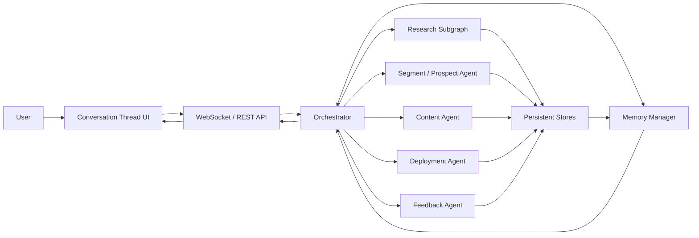

## 2. End-to-End Runtime Dataflow

This is the primary runtime path across the full campaign loop.

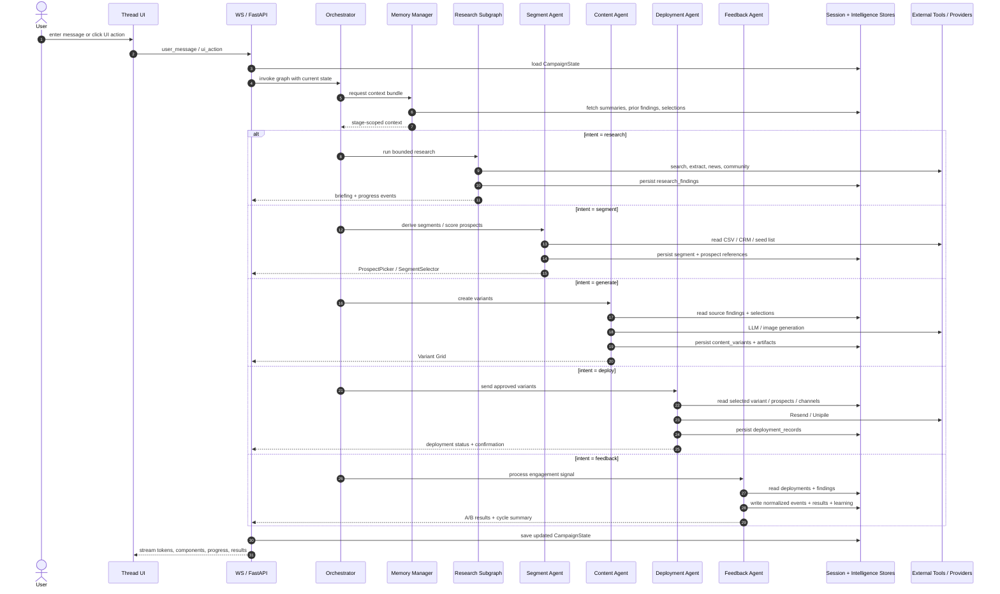

## 3. Core System Data Domains

The system carries several distinct data types. V2 makes the boundaries between them much clearer.

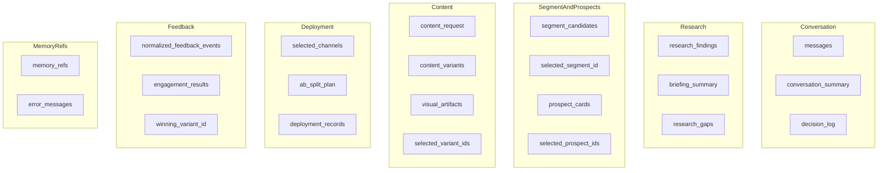

## 4. Research Dataflow

V1 already had fan-out / fan-in research. V2 strengthens it by adding bounded branching, more tool classes, and policy-based limits.

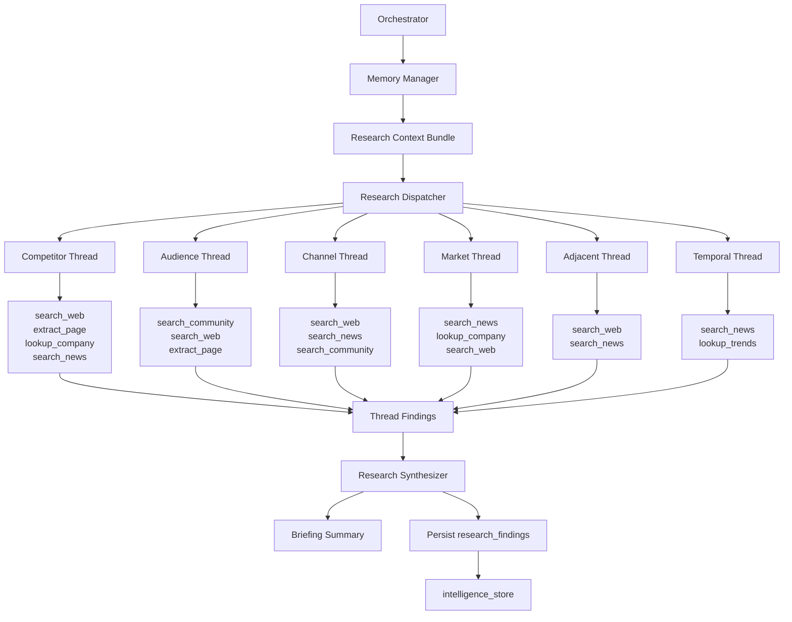

### Bounded branching control

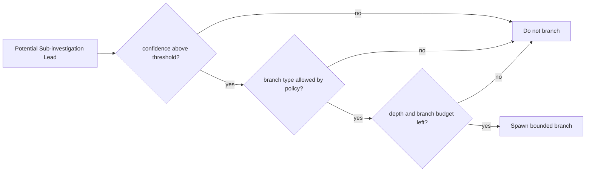

## 5. Segment and Prospect Flow

This stage is missing in V1 and introduced explicitly in V2.

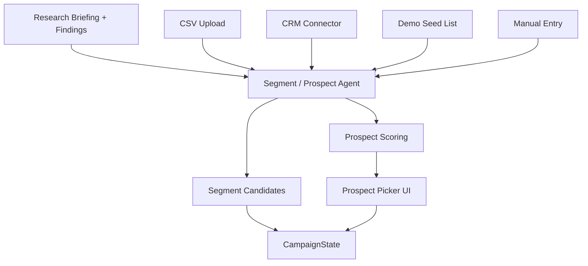

### Prospect scoring model

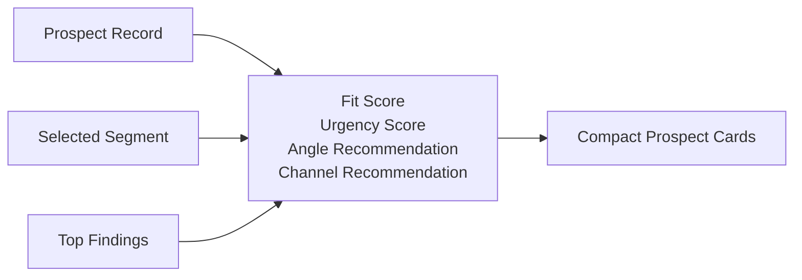

## 6. Content Generation and Traceability Flow

Content is not generated from raw conversation alone. It is assembled from selected, traceable upstream data.

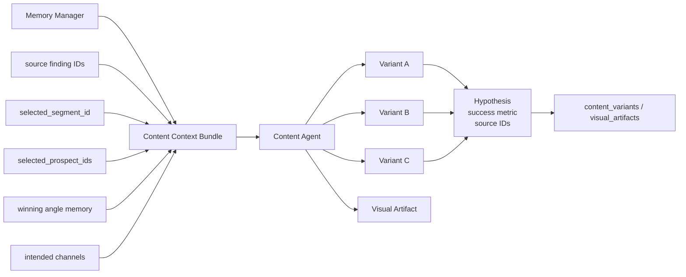

### Traceability chain

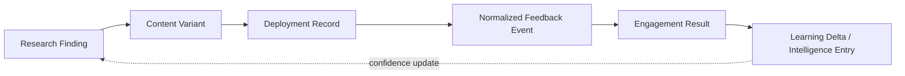

## 7. Deployment Dataflow

Deployment turns generated variants into provider-specific sends while preserving correlation IDs needed for later analysis.

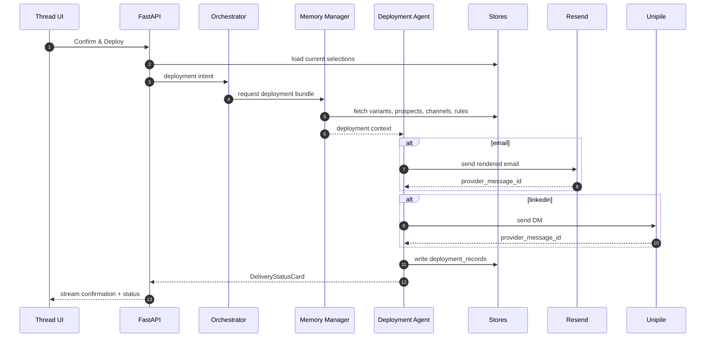

### Deployment record structure flow

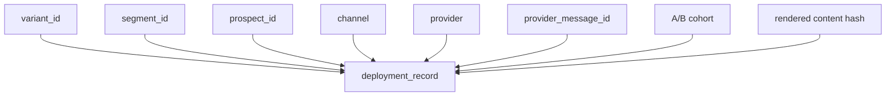

## 8. Feedback Ingestion and Learning Flow

Feedback can arrive from provider webhooks or manual reporting inside the conversation. Both paths should converge into the same normalized event model.

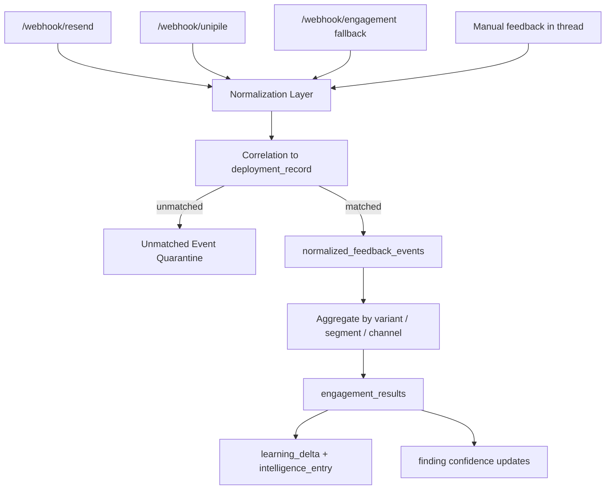

### Feedback update levels

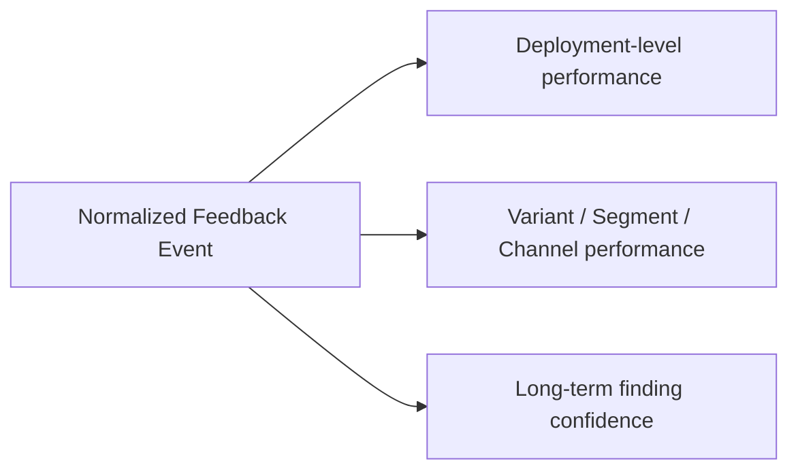

## 9. Memory Management Model

V2 introduces a proper Memory Manager and explicitly separates memory layers. This is one of the main architectural improvements over V1.

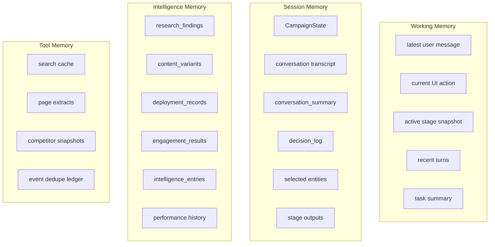

### Memory manager read/write behavior

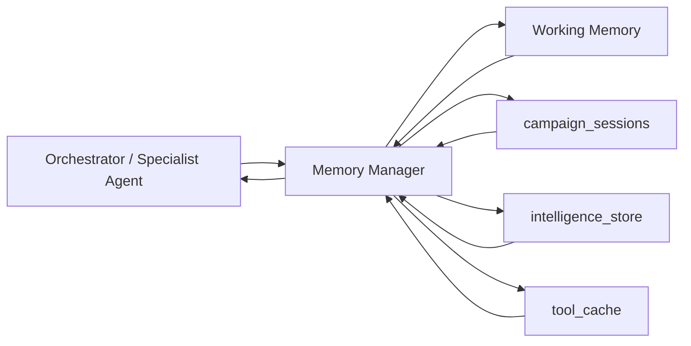

## 10. Context Bundle Construction

The key memory behavior is not “store everything in prompt”. It is “retrieve only what this stage needs”.

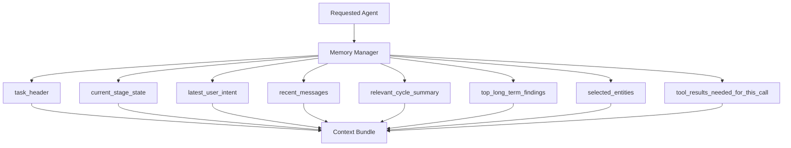

### Agent-specific budget policy

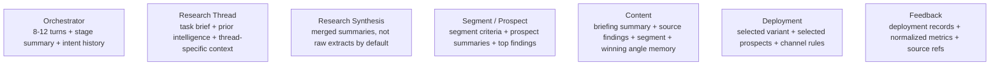

## 11. Summarization and Prompt Load Reduction

When the conversation grows, the system reduces prompt load while preserving the raw source of truth in storage.

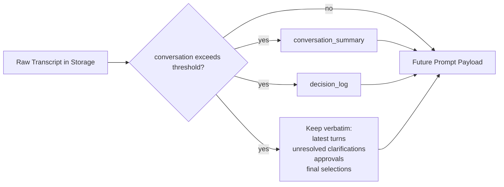

### UI-assisted memory reduction

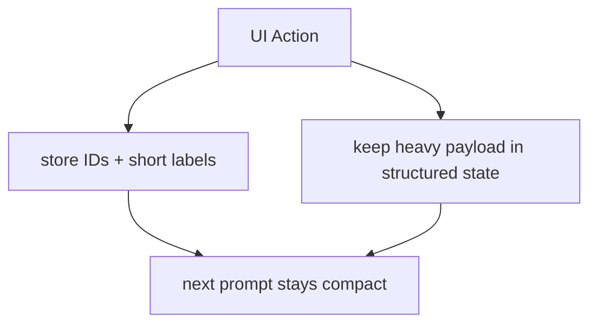

Examples:

- selecting a variant stores `variant_id`, not the full comparison card
- selecting prospects stores references, not full table data in chat history
- running next cycle passes `next_cycle_brief`, not the whole results widget

## 12. Persistence Layout

The main persistent data stores and their responsibilities are:

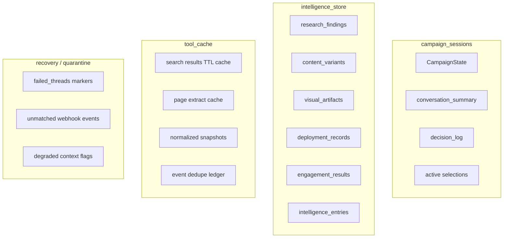

## 13. Failure-Aware Dataflow

The architecture is designed to keep the loop moving even when parts fail.

```mermaid
flowchart TD
    Start["Runtime Operation"]
    RF{"research thread failed?"}
    MF{"memory read / summary failed?"}
    DF{"deployment provider failed?"}
    CF{"feedback correlation failed?"}

    Partial["continue with partial findings"]
    Local["use local session cache / degraded context"]
    Retry["show retry or resend UI"]
    Quarantine["store unmatched event for retry correlation"]
    Continue["continue overall campaign loop"]

    Start --> RF
    RF -- yes --> Partial --> Continue
    RF -- no --> MF
    MF -- yes --> Local --> Continue
    MF -- no --> DF
    DF -- yes --> Retry --> Continue
    DF -- no --> CF
    CF -- yes --> Quarantine --> Continue
    CF -- no --> Continue
```

## 14. Best Single-Screen Summary

If you need one compact view, this is the most representative dataflow for the whole system.

```mermaid
flowchart LR
    U["User / Operator"]
    UI["Thread UI + Interactive Cards"]
    API["WS / FastAPI"]
    ORC["Orchestrator"]
    MEM["Memory Manager"]
    RES["Research"]
    SEG["Segment / Prospects"]
    GEN["Content"]
    DEP["Deployment"]
    FBK["Feedback"]

    SESS[("campaign_sessions")]
    INTEL[("intelligence_store")]
    CACHE[("tool_cache")]

    EXT1["Search / Extract / News / Community"]
    EXT2["CSV / CRM"]
    EXT3["Gemini / Imagen"]
    EXT4["Resend / Unipile"]

    U --> UI --> API --> ORC
    ORC <--> MEM

    MEM <--> SESS
    MEM <--> INTEL
    MEM <--> CACHE

    ORC --> RES --> EXT1
    ORC --> SEG --> EXT2
    ORC --> GEN --> EXT3
    ORC --> DEP --> EXT4
    ORC --> FBK

    RES --> INTEL
    SEG --> SESS
    GEN --> INTEL
    DEP --> INTEL
    FBK --> INTEL
    FBK --> SESS

    API --> UI
```

## 15. Key Architectural Takeaways from V1 to V2

- V1 defines the closed-loop architecture clearly, especially research, generation, deployment, and feedback.
- V2 makes memory explicit instead of relying too much on large-context prompting.
- V2 adds the missing operational stage between research and deployment: segment and prospect handling.
- V2 also hardens traceability by introducing normalized feedback events, provider correlation, and a first-class Memory Manager.
- The most important dataflow idea is that prompts carry curated summaries and references, while the heavy payloads stay in structured state and persistent stores.
